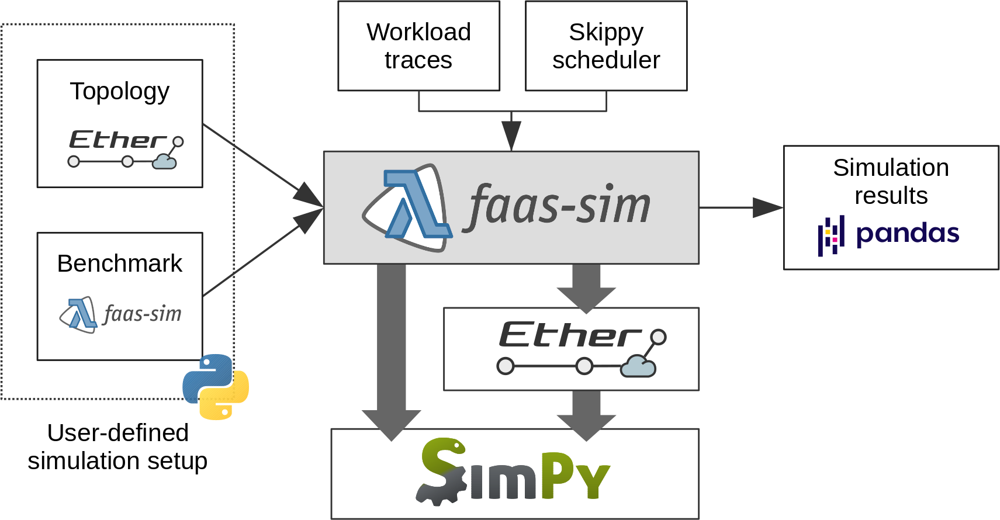
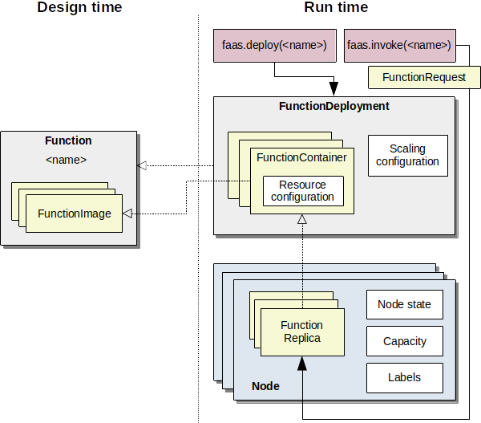
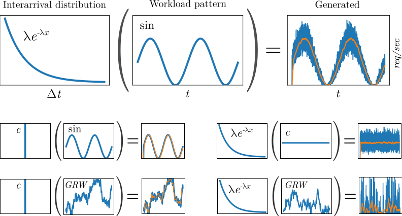
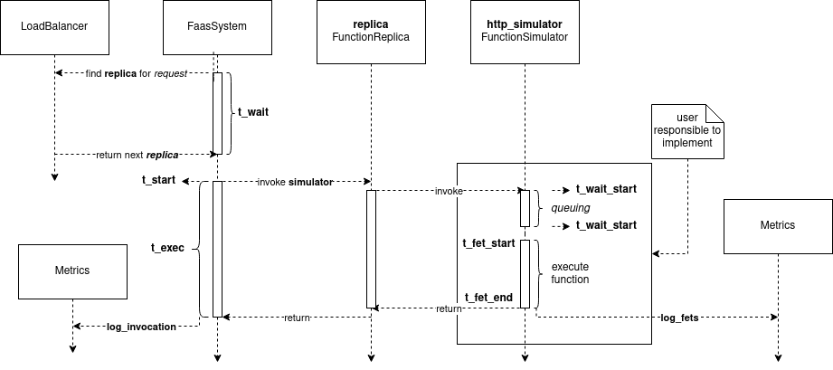

# faas-sim 文档

## 1 faas-sim 总览


faas-sim 是一个用于对容器化 Function-as-a-Service 平台进行 trace-driven 仿真的框架。它可用于开发和评估这类系统的运行管理策略，例如调度、自动伸缩、负载均衡以及其他平台运行机制。

### 架构

faas-sim 基于 [SimPy](https://simpy.readthedocs.io) 离散事件仿真框架构建。它使用 [Ether](https://github.com/edgerun/ether) 作为网络仿真层，同时借助 Ether 提供集群配置和网络拓扑来源。默认情况下，faas-sim 使用 [Skippy](https://github.com/edgerun/skippy-core) 调度系统进行 Serverless 资源调度；同时，用户可以插入自定义的调度器、自动伸缩器和负载均衡器。

faas-sim 采用 trace-driven 方式工作，使用真实负载和真实设备的 profiling 数据来模拟函数执行过程。项目预置了若干常见计算设备和代表性集群负载的 trace 数据，可用于快速启动实验。



### 背景

faas-sim 由 [TU Wien](https://tuwien.at) 的 [Distributed Systems Group](https://dsg.tuwien.ac.at) 开发，属于围绕 Serverless Edge Computing 系统开展的一系列研究工作的一部分。

## 2 核心概念

### 领域模型

faas-sim 对函数、函数部署以及运行中的函数实例建立了统一的概念模型。该模型用于把真实 FaaS 平台中的函数抽象、容器镜像、部署配置、运行实例和集群节点映射到仿真环境中。



上图展示了函数及其部署过程中的核心概念关系。

### Function

Function 是最高层次的抽象，表示一个由名称标识、可以通过 FunctionRequest 调用的功能单元。

例如，一个名为 `detect-objects` 的目标检测函数可以接收图像作为输入，并返回图像中对象的边界框和标签。一个 Function 由多个 FunctionImage 组成，每个 FunctionImage 对应一种部署平台或运行实现。

### FunctionImage

FunctionImage 在概念上表示某个函数在特定部署平台上的代码实现。

例如，`detect-objects` 函数可以有一个使用 GPU 的版本，也可以有一个使用 TPU 等 AI 加速器的版本。引入 FunctionImage 这一额外抽象，原因在于 Docker 等容器平台对多计算架构镜像的处理方式。不同 CPU 架构的 Docker 镜像可以通过 [multi-arch manifest](https://docs.docker.com/registry/spec/manifest-v2-2/) 组织到同一个多架构镜像中，`docker pull` 会根据节点架构拉取对应镜像。

但是，Docker 的多架构机制无法表达 GPU、TPU 等额外平台特征。如果同一个函数存在 CPU 镜像和 GPU 镜像，那么运行时可能无法明确应该拉取哪一个镜像。faas-sim 希望将这一决策交给资源调度器，使调度器能够决定某个函数在特定节点上应部署哪个镜像。

### FunctionDeployment

FunctionDeployment 表示 Function 的一个具体部署实例，包含资源分配配置和伸缩策略配置。一个部署由多个 FunctionContainer 以及相关配置组成。

### FunctionContainer

FunctionContainer 是 FunctionImage 的运行时配置。它包含具体的资源配置，用于声明某个 FunctionContainer 的副本部署到节点上时需要分配多少资源。

在前面的目标检测示例中，基于 GPU 的 `object-detector` 可能需要较少 CPU，但需要更多显存；而基于 CPU 的 FunctionImage 则可能需要更多 CPU 资源。

### FunctionReplica

FunctionReplica 是 FunctionContainer 的具体实例化结果，表示真实正在运行的函数实例，类似于 Docker 容器中的一个运行容器。

### Node

Node 表示集群中能够承载函数副本的计算机或计算节点。NodeState 是一个通用的数据容器，用于存储仿真运行时需要的数据。例如，为了计算性能退化，可以在 NodeState 中记录某个函数副本当前并发调用数量。

### FaaS System

`FaasSystem` 抽象是客户端交互的高层接口。可以将它理解为 OpenFaaS 中的主 API Gateway，或者 Kubernetes 中的 kube-apiserver。

其接口形式如下：

```python
class FaasSystem(abc.ABC):

    def deploy(self, fn: FunctionDeployment): ...

    def invoke(self, request: FunctionRequest): ...

    def remove(self, fn: FunctionDeployment): ...

    def suspend(self, fn_name: str): ...

    def discover(self, fn_name: str) -> List[FunctionReplica]: ...

    def scale_down(self, fn_name: str, remove: int): ...

    def scale_up(self, fn_name: str, replicas: int): ...

    # 额外查询方法：
    def poll_available_replica(self, fn: str, interval=0.5): ...

    def get_replicas(self, fn_name: str, state=None) -> List[FunctionReplica]: ...

    def get_function_index(self) -> Dict[str, FunctionContainer]: ...

    def get_deployments(self) -> List[FunctionDeployment]: ...
```

从概念上看，FaaS System 的主要阶段和接口含义如下。

- `deploy`：使函数变为可调用状态，并在集群上部署最小数量的 FunctionReplica。最小运行实例数量由 `ScalingConfiguration` 配置。
- `invoke`：由 `LoadBalancer` 选择一个副本，然后调用该副本关联的 `FunctionSimulator.invoke` 方法来模拟函数调用。
- `remove`：从平台中删除函数，并关闭所有正在运行的副本。
- `discover`：返回属于某个函数的所有运行中 FunctionReplica。
- `scale_down`：在不低于最小副本数要求的前提下，移除指定数量的运行中 FunctionReplica。当前实现优先选择最近部署的副本进行移除。
- `scale_up`：部署指定数量的 FunctionReplica，但必须遵守 `ScalingConfiguration` 中定义的最大副本数。
- `suspend`：对某个函数的所有运行中副本执行 teardown，常用于 `faas_idler`。
- `poll_available_replica`：反复等待并检查某个函数是否存在运行中的副本。
- `get_replicas`：获取某个函数在指定状态下的所有副本；当 `state == None` 时返回全部副本。
- `get_function_index`：返回所有已部署的 FunctionContainer。
- `get_deployments`：返回所有已部署的 FunctionDeployment 实例。

### Function simulators

FunctionSimulator 封装了函数的仿真代码，是 faas-sim 的核心抽象之一。faas-sim 内置了若干函数仿真器，它们以真实函数和真实工作负载的 trace 数据为基础执行仿真。

FunctionSimulator 的方法由仿真器调用，用于模拟函数生命周期中的不同阶段。

```python
class FunctionSimulator(abc.ABC):
    def deploy(self, env: Environment, replica: FunctionReplica):
        yield env.timeout(0)

    def startup(self, env: Environment, replica: FunctionReplica):
        yield env.timeout(0)

    def setup(self, env: Environment, replica: FunctionReplica):
        yield env.timeout(0)

    def invoke(self, env: Environment, replica: FunctionReplica, request: FunctionRequest):
        yield env.timeout(0)

    def teardown(self, env: Environment, replica: FunctionReplica):
        yield env.timeout(0)
```

从概念上看，FunctionSimulator 的生命周期阶段包括：

- `deploy`：FunctionReplica 被部署到节点上，例如通过 `docker pull` 拉取容器镜像。
- `startup`：副本启动过程，例如通过 `docker run` 启动容器。
- `setup`：副本运行时启动过程，例如 Python Runtime 启动解释器、加载依赖或初始化模型。
- `invoke`：某个 FunctionRequest 调用具体的函数副本。
- `teardown`：函数副本被销毁，例如由于 scale down 而被移除。

每当仿真器因为部署或伸缩动作创建新的函数副本时，SimulatorFactory 会被调用，用于创建或返回该副本对应的 FunctionSimulator。SimulatorFactory 可以被用户覆盖，从而实现多种行为：每次返回同一个 FunctionSimulator、为每个函数副本创建新实例，或根据函数、节点、镜像等上下文选择不同仿真器。

### Simulation

Simulation 封装了一次仿真的配置和运行时状态。一次 Simulation 需要两个输入：Topology 和 Benchmark。

#### Topology

Topology 包装 [Ether](https://github.com/edgerun/ether) 拓扑，用于表示集群配置和网络拓扑。

#### Benchmark

Benchmark 封装一个具体的仿真实验。它作为 SimPy 进程被调用，负责设置运行时系统，例如创建容器镜像、部署函数，并通过模拟函数请求生成工作负载。

faas-sim 提供了若干工具用于创建 Benchmark，例如请求生成器。Benchmark 包含两个方法：`setup` 和 `run`。

当仿真环境创建完成后，系统会调用 `setup` 方法。用户可以在该方法中准备被测系统，例如向模拟容器仓库中注册镜像。随后，`run` 方法会作为主 SimPy 进程被调用，仿真会一直运行到该进程结束。

### Request generators

Request generator 是用于创建工作负载生成器的可组合函数。使用示例如下：

```python
from sim.requestgen import expovariate_arrival_profile, constant_rps_profile

env = ...
gen = expovariate_arrival_profile(constant_rps_profile(20))

while True:
    ia = next(gen)
    yield env.timeout(ia)
    # 发送下一个请求
```

下图展示了若干到达过程和工作负载模式组合后的请求模式。



上图展示了如何组合 inter-arrival distribution 与 workload pattern 来生成工作负载。

第一行展示了如何构造随机化的正弦请求模式。对于 interarrival distribution，示例使用指数分布。指数分布的概率密度函数为 \(\lambda e^{-\lambda x}\)，其中 \(\frac{1}{\lambda}\) 是均值。工作负载模式遵循正弦波，并使用 \(\sin(t)\) 的值作为 \(\lambda\)，从而缩放 interarrival distribution。

因此，在仿真时，系统会从分布 \(\sin(t)e^{-\sin(t)x}\) 中采样，以得到下一次请求到来前的等待时间。图中的橙色线表示请求每秒数量的移动平均值，它应大致匹配工作负载模式。

第二行展示了 constant interarrival distribution 如何精确复制工作负载模式，以及 constant workload profile 如何与 expovariate distribution 组合，形成具有随机到达间隔的静态负载模式。

最后一行展示了 Gaussian random walks（GRW）。其中每个值表示从正态分布中采样得到的随机样本，并作为下一次随机采样中的 \(\mu\) 值。请求 profile 可以通过 \(\sigma\) 参数控制随时间波动的幅度。

提示：可以在项目的 Jupyter Notebook `workload_patterns.ipynb` 中找到生成这些模式的代码示例，也可以查看 `examples/request_gen` 下的仿真示例。

## 3 系统实现

本节说明 faas-sim 中 `FaasSystem` 实现的内部工作机制。`FaasSystem` 的 API 围绕真实系统需求设计，表示典型 API Gateway 中常见的操作，例如 [OpenFaaS](https://docs.openfaas.com/) 中的网关操作。

faas-sim 提供了 `FaasSystem` 的默认实现，即 `sim.faas.system.py` 中的 `DefaultFaasSystme`。本节解释该实现的内部工作方式、涉及的组件以及用户可以如何配置系统。

`FaasSystem` 需要实现的方法如下：

```python
class FaasSystem(abc.ABC):

    def deploy(self, fn: FunctionDeployment): ...

    def invoke(self, request: FunctionRequest): ...

    def remove(self, fn: FunctionDeployment): ...

    def discover(self, fn_name: str) -> List[FunctionReplica]: ...

    def scale_down(self, fn_name: str, remove: int): ...

    def scale_up(self, fn_name: str, replicas: int): ...

    def suspend(self, fn_name: str): ...

    # 以及若干额外查询方法
```

为了实现这些函数，DefaultFaasSystem 维护如下内部状态。

> 注意：本节描述的是当前 `FaasSystem` 实现的内部细节，后续版本可能发生变化。为了降低兼容性风险，外部代码应优先使用公开查询方法，而不是直接依赖内部字段。

- `env: Environment`：用于访问全局配置组件，例如 `Metrics`、`SimulatorFactory` 和 `ClusterContext`。
- `function_containers: Dict[str, FunctionContainer]`：存储已部署函数中所有可用的函数容器。
- `replicas: Dict[str, List[FunctionReplica]]`：按照 FunctionDeployment 名称收集对应的 FunctionReplica 列表。
- `scheduler_queue: simpy.Store`：保存需要被调度的函数副本。`scale_up` 会将副本放入队列，`run_schedule_worker` 会从队列中轮询取出副本并执行调度。
- `load_balancer: LoadBalancer`：在 `invoke` 过程中被调用，用于选择处理本次调用的函数副本。目前默认实现为 round-robin。
- `functions_deployments: Dict[str, FunctionDeployment]`：存储已部署函数，主要由 `deploy` 和 `remove` 修改。
- `replica_count: Dict[str, int]`：统计每个 FunctionDeployment 当前活跃副本数量。
- `functions_definitions: Counter`：统计每个 FunctionContainer 对应的副本数量。

### Resources

由于 `FunctionSimulator` 具有很高的灵活性，资源仿真需要由用户根据具体模型实现。例如，函数执行可能受到排队机制影响，因此资源并不一定在请求到达时立即消耗，而应由 `FunctionSimulator` 在恰当的时间点声明资源使用。

faas-sim 提供了一套基于字典的标准资源管理接口。这一接口允许 faas-sim 实现通用组件，例如节点与函数资源监控，以及 [Kubernetes HPA](https://kubernetes.io/docs/tasks/run-application/horizontal-pod-autoscale/) 的实现。资源值会按键累加。

下面的代码展示了一个消耗资源的示例：

```python
class CpuConsumingSim(FunctionSimulator):

    def __init__(self, queue: simpy.Resource):
        self.queue = queue

    def invoke(self, env: Environment, replica: FunctionReplica, request: FunctionRequest):
        token = self.queue.request()
        yield token

        # 资源定义由用户决定。
        # 这里假设一次函数调用在整个调用期间需要占用 20% CPU。
        env.resource_state.put_resource(replica, 'cpu', 0.2)

        yield env.timeout(1)

        # 调用结束后释放资源。
        env.resource_state.remove_resource(replica, 'cpu', 0.2)
```

`Environment` 对象包含 resource monitor。该监控器会持续收集当前资源利用率，并将数据写入 `MetricsServer`。随后，用户可以通过 `MetricsServer` 查询某类资源在指定时间范围内的平均使用情况。

## 4 结果分析

仿真结果分析通过在仿真完成后提取 pandas DataFrame 完成，例如：

```python
sim.env.metrics.extract_dataframe(<name>)
```

Simulation 的 Environment 中包含一个 `Metrics` 对象。该对象贯穿整个仿真过程，用于记录事件。这些事件描述 FaaS 平台 `FaasSystem` 的不同方面，例如调度过程、数据流和函数调用。

### 默认日志

`FaasSystem` 的默认实现 `DefaultFaasSystem` 会记录以下过程的事件。这些事件可以使用对应名称提取为 DataFrame。(默认有14个 DataFrame)

| 过程 | DataFrame 名称 |
| --- | --- |
| Allocation | `'allocation'` |
| Invocations | `'invocations'` |
| Scaling | `'scale'` |
| Scheduling | `'schedule'` |
| Function Replica Deployment | `'replica_deployment'` |
| Function Deployments | `'function_deployments'` |
| Function Deployment | `'function_deployment'` |
| Function Deployment lifecycle | `'function_deployment_lifecycle'` |
| Functions | `'functions'` |
| Flow | `'flow'` |
| Network | `'network'` |
| Node utilization | `'node_utilization'` |
| Function utilization | `'function_utilization'` |
| Function Execution Times | `'fets'` |

提示：项目在 `examples/analysis/main.py` 中提供了基础示例。每个 DataFrame 的具体字段含义可结合对应实现代码和后续分析逻辑进一步查看。

### Logging

仿真过程中会记录系统的多个方面。日志主要由核心实现产生，但也有一些部分留给用户根据自定义仿真器或自定义组件补充记录。

`Metrics` 定义了通用 `log` 函数，也提供了若干开箱即用的日志函数，用于记录 FaaS 平台生命周期中的特定事件。

`Metrics` 构造函数接收一个 `RuntimeLogger` 对象作为初始化参数。该 logger 负责存储所有记录，并可以通过传入 `Clock` 对象进行配置。`Clock` 决定每条日志事件对应的时间。

提示：可以查看 `sim.logging` 了解不同日志实现。

## 5 函数仿真器

本节展示 faas-sim 中一部分预定义 FunctionSimulator，并说明如何自行实现 FunctionSimulator。

faas-sim 的设计和架构受到 [OpenFaaS](https://docs.openfaas.com/) 的显著影响。因此，faas-sim 提供了两个 FunctionSimulator 实现，用于模拟 OpenFaaS 中 [Watchdog modes](https://github.com/openfaas/of-watchdog#modes) 的 forking 模式和 HTTP 模式。

相关实现位于：

```text
sim/faas/watchdogs.py
```

可以通过如下方式导入：

```python
from sim.faas import ForkingWatchdog, HTTPWatchdog
```

表示通用 Watchdog 概念的抽象类大致如下：

```python
class Watchdog(FunctionSimulator):

    def claim_resources(self, env: Environment, replica: FunctionReplica, request: FunctionRequest): ...

    def release_resources(self, env: Environment, replica: FunctionReplica, request: FunctionRequest): ...

    def execute(self, env: Environment, replica: FunctionReplica, request: FunctionRequest): ...
```

`HTTPWatchdog` 使用排队机制来模拟 worker。请求在获得 token，也就是有可用 worker 之后，才会声明资源并继续执行。

`ForkingWatchdog` 不经过额外排队延迟，而是立即为每个请求声明资源并执行请求。

> 注意：使用 `ForkingWatchdog` 时，应手动限制请求数量，因为每次 fork 都会消耗内存。如果不做限制，可能会模拟出过高的并发资源消耗。

下图展示了使用 `HTTPWatchdog` 执行期间产生的日志事件，并展示了不同系统组件之间的交互关系。



## 6 示例

官方文档的 Examples 页面指向项目的 GitHub repository，用于查看示例代码。

在本离线项目中，可以直接查看根目录下的 `examples/` 目录。该目录包含以下常见示例：

```text
examples/analysis/
examples/basic/
examples/custom_function_sim/
examples/custom_scheduler/
examples/request_gen/
examples/watchdogs/
```

这些示例覆盖仿真结果分析、基础仿真、自定义函数仿真器、自定义调度器、请求生成器以及 Watchdog 风格函数仿真器等用法。
