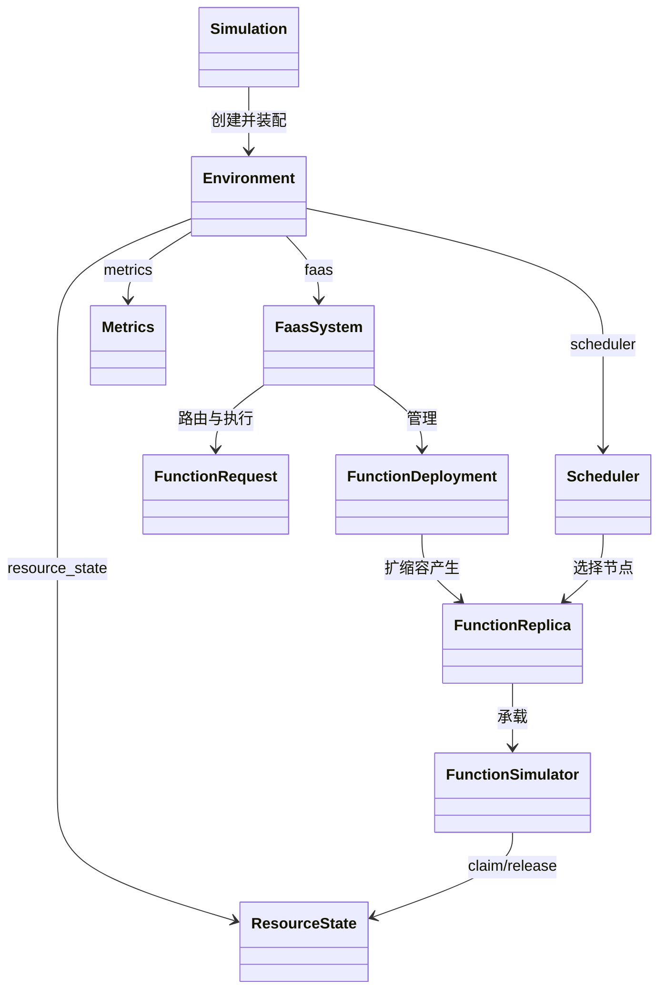

# `sim` 源码文档目录与阅读导航

## 1. 文档目标

`sim` 是本项目的无服务器计算（FaaS）离散事件仿真层。它建立在 SimPy 事件引擎之上，并接入 Skippy 调度器，用于描述函数部署、容器启动、请求到达、数据传输、资源竞争、自动伸缩和指标采集等过程。

这些文档不只是 API 列表，而是回答以下源码阅读问题：

1. 每个文件负责什么，为什么需要它？
2. 类、方法和字段在完整业务流程中处于什么位置？
3. SimPy 事件、FaaS 对象、Skippy 调度和资源监控如何连接？
4. 新增函数模拟器、伸缩器、调度策略或 Oracle 时应扩展哪里？
5. 哪些对象表示“配置”，哪些对象表示“运行时状态”，哪些对象只负责记录结果？

## 2. 源码分层总览

```text
实验与负载层
benchmark.py / requestgen.py
        |
        v
仿真装配层
faassim.py
        |
        v
FaaS 领域层
faas/core.py / faas/system.py / faas/scaling.py / faas/watchdogs.py
        |
        +--------------------+
        |                    |
        v                    v
调度与拓扑层             资源与性能层
skippy.py / topology.py   resource.py / degradation.py / oracle/
        |                    |
        +----------+---------+
                   v
基础设施与观测层
core.py / docker.py / net.py / metrics.py / logging.py
                   |
                   v
                SimPy
```

## 3. 文档目录

| 编号 | 文档 | 对应源码 | 重点 |
|---|---|---|---|
| 01 | [sim 包入口](01_sim包入口.md) | `sim/__init__.py`、`sim/faas/__init__.py`、`sim/oracle/__init__.py` | 包边界、公开对象和导入关系 |
| 02 | [全局环境](02_全局环境core.md) | `sim/core.py` | `Environment`、节点运行时状态、超时监听 |
| 03 | [FaaS 领域模型](03_FaaS领域模型core.md) | `sim/faas/core.py` | 函数、容器、Pod、副本、请求、负载均衡器和接口协议 |
| 04 | [FaaS 系统实现](04_FaaS系统system.md) | `sim/faas/system.py` | 部署、调度、启动、调用、数据传输和删除流程 |
| 05 | [自动伸缩](05_自动伸缩scaling_hpa.md) | `sim/faas/scaling.py`、`sim/hpa.py` | 请求伸缩、队列伸缩、空闲缩容和 HPA |
| 06 | [Watchdog 函数模拟](06_watchdog函数模拟.md) | `sim/faas/watchdogs.py` | Forking/HTTP watchdog 的资源与并发语义 |
| 07 | [Python 中高级语法](07_Python中高级语法与sim源码阅读.md) | 全项目 | 阅读源码所需的生成器、协议、继承、装饰器等语法 |
| 08 | [仿真实验装配](08_仿真实验装配faassim.md) | `sim/faassim.py` | `Simulation` 生命周期和模拟器工厂 |
| 09 | [Benchmark 与请求生成](09_Benchmark与请求生成.md) | `sim/benchmark.py`、`sim/requestgen.py` | 工作负载定义、到达过程和可复现实验 |
| 10 | [资源状态与监控](10_资源状态与监控resource.md) | `sim/resource.py` | 资源申请、释放、窗口聚合和周期采样 |
| 11 | [指标与日志](11_指标与日志metrics_logging.md) | `sim/metrics.py`、`sim/logging.py` | 结构化记录、仿真时钟和日志后端 |
| 12 | [拓扑与 Skippy 适配](12_拓扑与Skippy适配.md) | `sim/topology.py`、`sim/skippy.py` | 节点转换、调度上下文、带宽图和 Pod 创建 |
| 13 | [镜像仓库与网络](13_镜像仓库与网络docker_net.md) | `sim/docker.py`、`sim/net.py` | 镜像解析、拉取、缓存和安全流量模型 |
| 14 | [Oracle 估计体系](14_Oracle估计体系.md) | `sim/oracle/*` | 启动时间、执行时间、带宽、成本和资源估计 |
| 15 | [性能退化](15_性能退化degradation.md) | `sim/degradation.py` | 退化模型输入和节点级缓存 |
| 16 | [完整业务调用链](16_完整业务调用链.md) | 跨模块 | 从实验启动到指标落盘的端到端路径 |

## 4. 推荐阅读路线

### 4.1 快速建立整体认识

```text
00 目录 -> 02 Environment -> 03 领域模型 -> 04 FaaS 系统
       -> 08 Simulation -> 16 完整调用链
```

这条路线适合先理解“系统如何跑起来”，暂时跳过估计模型和细节实现。

### 4.2 面向调度与资源管理

```text
03 领域模型 -> 10 资源状态 -> 12 Skippy 适配
       -> 13 网络与镜像 -> 14 Oracle
```

### 4.3 面向负载与自动伸缩

```text
09 Benchmark/请求生成 -> 05 自动伸缩
       -> 04 调用流程 -> 11 指标
```

### 4.4 面向二次开发

先读 `07` 掌握语法，再根据目标选择扩展点：

| 目标 | 首选扩展点 |
|---|---|
| 新增函数执行模型 | `FunctionSimulator`、`SimulatorFactory` |
| 新增容器/watchdog 模式 | `Watchdog` |
| 新增负载模型 | `Benchmark`、`requestgen.py` |
| 新增伸缩算法 | `sim/faas/scaling.py` 或 `sim/hpa.py` |
| 新增调度策略 | Skippy scheduler 配置或调度优先级插件 |
| 新增性能估计 | `Oracle` 子类 |
| 新增指标 | `Metrics` 的结构化日志方法 |

## 5. 核心对象关系



## 6. 阅读源码时需要始终区分的三类对象

1. **声明对象**：描述“希望系统是什么样”，如 `Function`、`FunctionDeployment`、容器资源需求。
2. **运行时对象**：描述“仿真当前发生了什么”，如 `FunctionReplica`、`FunctionRequest`、`NodeState`、`ResourceState`。
3. **观测对象**：不改变业务状态，只记录和聚合，如 `Metrics`、`RuntimeLogger`、`MetricsServer`。

很多理解错误都源于混淆这三类对象。例如 `FunctionDeployment` 的副本配置不是某个请求的执行状态，而 `FunctionReplica` 才是具体运行实例。

## 7. 文档与源码的一致性说明

文档按当前仓库源码编写。阅读时应以源码行为为最终依据，特别注意以下事实：

- 仿真时间由 SimPy 推进，不等于墙上时钟。
- `yield` 表示进程等待事件，不是普通函数返回。
- 请求调用的通用框架与数据下载/上传是分开的；具体模拟器决定何时触发数据传输。
- Skippy 负责调度决策，`sim` 负责把调度结果转成仿真状态变化。
- Oracle 提供估计值，不直接执行函数或修改调度状态。
