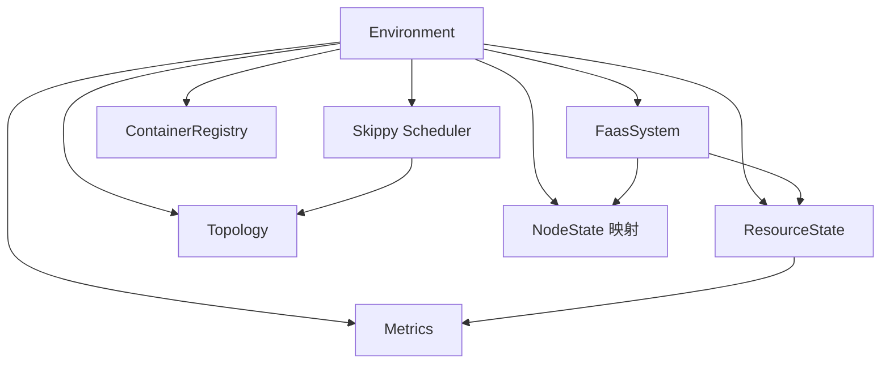

# 全局仿真环境：`sim/core.py`

## 1. 模块定位

`sim/core.py` 在 SimPy `Environment` 之上建立项目级运行上下文。它不是一个普通的“配置对象”，而是整个仿真的：

- 离散事件时钟；
- 进程调度入口；
- 跨模块依赖容器；
- 节点运行时状态索引；
- 后台任务登记处。

理解该文件是阅读 `sim` 源码的第一步，因为几乎所有长生命周期对象都通过 `env` 相互协作。

## 2. `Environment` 与 SimPy 的关系

项目中的 `Environment` 继承 SimPy 环境，因此保留以下基本语义：

```python
env.now                 # 当前仿真时间
env.timeout(delay)      # 创建延迟事件
env.process(generator)  # 注册生成器进程
env.run(until=...)      # 推进事件队列
```

关键点是：`env.now` 是逻辑时间。执行 Python 代码本身通常不增加仿真时间，只有事件被调度并触发后，时钟才会向前推进。

## 3. 环境中的系统组件

`Environment` 持有或允许装配下列组件：

| 字段 | 作用 |
|---|---|
| `faas` | FaaS 控制面和请求入口 |
| `simulator_factory` | 为副本创建具体 `FunctionSimulator` |
| `topology` | 节点和网络链路拓扑 |
| `storage_index` | 数据对象到存储位置的索引 |
| `benchmark` | 当前实验工作负载 |
| `cluster` | 节点/Pod 集群视图 |
| `container_registry` | 容器镜像仓库及镜像属性 |
| `metrics` | 结构化指标记录器 |
| `scheduler` | Skippy 调度器 |
| `metrics_server` | 资源指标缓存与查询服务 |
| `resource_state` | 当前资源占用状态 |
| `resource_monitor` | 周期资源采样进程 |
| `node_states` | 节点名到 `NodeState` 的映射 |
| `background_processes` | 需要统一等待或管理的后台进程 |
| `degradation_models` | 性能退化模型集合 |

这是一种显式依赖装配方式。模块不需要访问大量全局变量，而是从同一个 `env` 获取协作者。

## 4. `NodeState`

`NodeState` 保存单个节点在仿真期间的动态状态。它与 Skippy 的节点规格不同：节点规格描述容量和标签，`NodeState` 描述随时间变化的运行信息。

主要信息包括：

- `ether_node` 与 `skippy_node` 两套节点视图；
- 已缓存或可用的容器镜像；
- 当前正在执行的请求；
- 节点曾处理过的全部请求；
- 性能退化模型及其计算缓存。

可将二者理解为：

```text
Skippy Node = 节点静态能力与调度视图
NodeState   = 节点仿真运行时历史与瞬时状态
```

节点状态以节点名称为键保存到 `env.node_states`。`Environment.get_node_state(name)` 采用延迟创建，首次查询时才绑定 Ether/Skippy 节点和可选退化模型。

### 4.1 请求历史方法

- `get_calls_in_timeframe(start_ts, end_ts)`：筛选与窗口重叠的调用；
- `set_end(request_id, end)`：补写历史调用结束时间；
- `clean_up()`：达到缓存阈值后删除不再影响未完成请求的旧记录。

这些方法依赖历史调用对象具有 `start`、`end`、`request_id` 等属性。基础 `FunctionRequest` 只预定义了部分字段，具体 simulator 若使用退化功能，需要在执行路径中补齐并维护时间字段。

### 4.2 `estimate_degradation()`

该方法按四舍五入后的 `(start, end)` 查询缓存；未命中时构造模型输入并调用 sklearn 回归器 `predict()`。无模型或无有效输入时返回 `0`。返回值如何作用于基础执行时间由具体 simulator 决定。

## 5. 性能退化缓存

退化模型可能依赖当前节点上并发请求、函数类型、资源申请等输入。重复执行模型既昂贵又可能导致同一状态被多次计算，因此 `NodeState` 同时承担模型结果缓存职责。

缓存使用时应注意：

1. 缓存键必须能代表影响退化值的输入；
2. 节点负载变化后，旧结果不能被误认为当前结果；
3. 退化模型只是影响执行时长或吞吐，不应直接修改资源账本。

## 6. `SimulationTimeoutError`

`SimulationTimeoutError` 用于表达“仿真程序的真实运行时间超过限制”。它限制的是墙上时钟，不是 `env.now`：

- `time.time() - started`：程序实际运行了多少秒；
- `env.now`：模型内部已经模拟了多少时间。

当前异常处理的是前者。若要限制逻辑实验时长，应使用 `env.run(until=...)`、终止事件或 benchmark 自身的持续时间。

## 7. `timeout_listener`

`timeout_listener(env, started, max_time, interval=1)` 是一个 SimPy 生成器进程。它每经过 `interval` 个仿真时间单位检查一次真实运行时间：

```python
def timeout_listener(env, started, max_time, interval=1):
    while True:
        yield env.timeout(interval)
        if time.time() - started > max_time:
            raise SimulationTimeoutError()
```

调用该函数本身不会执行函数体，必须通过 `env.process(...)` 注册：

```python
listener = env.process(timeout_listener(env, started, max_time=60))
```

## 8. 典型装配顺序

```text
创建 Environment
  -> 注入 topology / cluster / registry
  -> 创建 metrics / resource_state / metrics_server
  -> 创建 scheduler 与 faas system
  -> node_states 保持空表，使用时延迟创建
  -> 注册监控、调度 worker、超时监听等后台进程
  -> 启动 benchmark
  -> env.run()
```

组件装配顺序很重要。例如调度器开始工作前必须能访问集群和拓扑，函数启动前必须存在 registry，资源监控开始采样前必须存在 resource_state。

## 9. 跨模块关系



## 10. 常见误区

### 10.1 把 `env` 当成普通参数

`env` 同时携带时间、事件队列和依赖对象。将不同环境中的事件或对象混用，会导致难以解释的调度行为。

### 10.2 忘记注册生成器

调用一个包含 `yield` 的函数只会返回生成器。只有 `env.process(generator)` 才会让它参与事件调度。

### 10.3 直接修改 `env.now`

仿真时间应通过 `yield env.timeout(...)` 或等待其他事件推进，不能把 `env.now` 当作普通计数器赋值。

### 10.4 环境字段未装配

`Environment` 是灵活的依赖容器，但灵活也意味着某些字段可能在使用前仍为空。新增实验入口时应复用 `Simulation` 的标准装配过程。

## 11. 阅读检查点

- `Environment` 相比原生 SimPy 环境增加了哪些职责？
- `NodeState` 与调度器节点对象有什么区别？
- 为什么调用生成器函数后还要使用 `env.process`？
- 当前 `timeout_listener` 限制的是仿真时间还是墙上时间？
