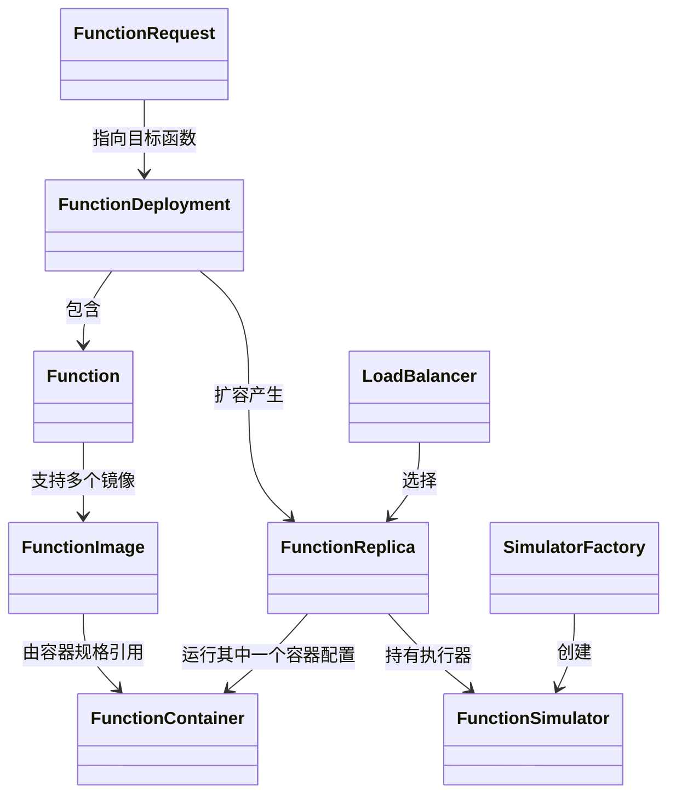

# FaaS 领域模型：`sim/faas/core.py`

## 1. 模块定位

`sim/faas/core.py` 是 `sim` 中最大的领域模型文件。它定义 FaaS 世界里“有哪些对象”和“对象之间遵守什么协议”，但尽量不负责完整部署、启动和调用流程。

阅读时可按四层理解：

1. **声明层**：函数定义、部署配置、容器配置；
2. **运行层**：副本、请求、状态和统计；
3. **控制接口层**：`FaasSystem`、`FunctionSimulator`、`SimulatorFactory`；
4. **策略层**：负载均衡器及副本选择策略。

## 2. 核心对象关系



## 3. 函数声明模型

### 3.1 `Resources` 与资源配置

`Resources` 保存 Kubernetes 风格的 CPU 毫核和内存字节数。`Resources.from_str(memory, cpu)` 支持把容量字符串和 `500m` 一类 CPU 字符串转换成内部数值。

`ResourceConfiguration` 是资源配置协议，默认实现 `KubernetesResourceConfiguration` 把 `Resources` 转换成调度器需要的字典：

```python
{'cpu': requests.cpu, 'memory': requests.memory}
```

### 3.2 `FunctionImage` 与 `Function`

`FunctionImage` 是镜像字符串的轻量包装。`Function` 才是源码中的函数定义类，它保存函数名、可选镜像和标签，并可按镜像字符串查找对应 `FunctionImage`。

一个逻辑函数可以有多个镜像，例如不同架构或不同实现版本；当前部署排序决定优先使用哪一个。

### 3.3 `FunctionContainer`

`FunctionContainer` 描述部署函数所需的容器镜像及资源条件。它属于配置，不是正在运行的容器进程。

常见信息包括：

- 镜像名称；
- CPU、内存等资源请求；
- 架构或标签约束；
- 运行时需要的附加配置。

调度器主要根据这些声明判断 Pod 是否能放到某节点上，镜像拉取模块则根据镜像名称和节点缓存估算启动准备时间。

### 3.4 `DeploymentRanking`

`DeploymentRanking` 保存镜像优先顺序以及可选的 `function_factor` 权重。`set_first(image)` 可以把某镜像提升到首位，扩容选择服务或容器时会读取该顺序。

### 3.5 `ScalingConfiguration`

伸缩配置集中保存最小/最大副本数、调整比例、scale-to-zero、RPS 阈值、观察窗口、目标 CPU 利用率、目标请求数和目标队列长度。配置本身不启动控制器，`DefaultFaasSystem` 在部署阶段根据启用选项创建相应后台进程。

### 3.6 `FunctionDeployment`

`FunctionDeployment` 是部署级配置与运行时集合的连接点，通常包含：

- `Function` 定义；
- 最小、最大或期望副本数；
- 伸缩配置；
- 当前副本集合；
- 部署相关状态。

它与 `FunctionReplica` 的区别：

```text
FunctionDeployment = 一个函数服务的整体部署
FunctionReplica    = 该部署中的一个具体运行实例
```

一个 deployment 可以拥有零个、一个或多个 replica。

## 4. 性能与资源画像

### 4.1 `FunctionResourceCharacterization`

该对象保存 `cpu`、`blkio`、`gpu`、`net`、`ram` 五维执行资源画像，并实现 `[]` 读写接口。它表达模型估计的执行资源需求，不等于 Kubernetes 静态资源请求，也不等于 `ResourceState` 的当前采样值。

### 4.2 `FunctionCharacterization`

该类把镜像、`FetOracle` 和 `ResourceOracle` 绑定在一起：

- `sample_fet(host)` 按主机和镜像采样执行时间；
- `get_resources_for_node(host)` 查询资源画像。

它是具体 simulator 接入执行时间与资源模型的便捷聚合对象。

## 5. 运行时模型

### 5.1 `FunctionState`

源码定义四种副本状态：

| 状态 | 含义 |
|---|---|
| `CONCEIVED` | 已创建，尚未完成调度和启动 |
| `STARTING` | 正在 deploy/startup/setup |
| `RUNNING` | 可接收请求 |
| `SUSPENDED` | 已挂起，不应再被路由 |

### 5.2 `FunctionReplica`

副本贯穿完整生命周期：创建、排队、调度、拉取镜像、启动、运行、停止和删除。副本通常关联：

- 所属 deployment；
- 唯一标识或副本编号；
- 当前状态；
- 被调度到的节点；
- Skippy Pod 表示；
- 具体 `FunctionSimulator`；
- 请求队列、并发计数或统计信息。

副本状态是业务正确性的关键。负载均衡器只应选择可接受请求的运行中副本，删除流程不能把仍在执行的副本立即当作可回收资源。

### 5.3 副本生命周期

概念上的状态流如下：

```text
新建
  -> 等待调度
  -> 已调度
  -> 镜像准备/容器启动
  -> RUNNING
  -> 停止中
  -> SUSPENDED/移除
```

源码中的具体枚举名称应以当前实现为准，但阅读时应检查每次状态变化是否同时完成了对应副作用，例如加入调度队列、绑定节点、创建 simulator 和释放资源。

### 5.4 `FunctionRequest`

`FunctionRequest` 表示一次函数调用，通常记录：

- 请求标识；
- 目标函数或部署；
- 类级递增生成器产生的 `request_id`；
- 目标函数名 `name`；
- 可选请求数据大小 `size`。

它不是 HTTP 客户端对象，而是仿真中的请求实体。请求等待、执行、传输产生的时间都通过关联进程推进。

当前 `FunctionRequest` 本身保持轻量，并没有内置完整状态枚举或起止时间字段；这些运行时信息主要由调用进程、节点请求集合和 Metrics 记录。阅读时不要假设请求对象拥有文档外的状态字段。

### 5.5 `FunctionResponse`

`FunctionResponse` 是调用结果的命名元组，字段为 `request_id`、响应 `code`、等待时间 `t_wait`、执行时间 `t_exec` 和节点名 `node`。请求输入和响应输出分开建模，便于调用方统一读取结果。

### 5.6 请求概念阶段

一次请求大体经历：

```text
CREATED/ARRIVED
  -> 等待可用副本
  -> 被路由
  -> EXECUTING
  -> FINISHED 或 FAILED
```

指标记录通常围绕这些阶段计算排队延迟、执行时长和端到端响应时间。

## 6. `FaasSystem` 接口

`FaasSystem` 描述 FaaS 控制面的能力，是上层 benchmark 与底层实现之间的协议。典型职责包括：

- `deploy(...)`：注册一个函数部署；
- `scale_up(...)` / `scale_down(...)`：调整副本数量；
- `invoke(...)`：提交函数请求；
- 查询 deployment、replica 和状态；
- 删除或停止部署。

`sim/faas/system.py` 中的 `DefaultFaasSystem` 实现这些行为。把接口与实现分开，使测试或实验可以替换控制面实现。

## 7. `FunctionSimulator`

`FunctionSimulator` 是“某个已运行副本如何处理请求”的抽象接口。它通常提供：

- 副本初始化或启动行为；
- `invoke(request)` 请求执行过程；
- 资源申请和释放；
- 数据下载与上传时机；
- 执行时间或退化模型接入。

其方法常返回生成器，因此调用方一般使用 `yield from` 或 `env.process`。新增函数性能模型时，应优先实现该抽象，而不是把函数特有逻辑写入 `DefaultFaasSystem`。

## 8. `SimulatorFactory`

工厂根据副本、镜像、函数名或实验配置选择具体 `FunctionSimulator`。它解决两个问题：

1. 控制面不需要知道所有函数模型的具体类；
2. 不同函数可在同一实验中使用不同执行模型。

典型创建关系：

```text
replica 已完成调度并准备启动
  -> simulator_factory.create(env, replica)
  -> 得到 FunctionSimulator
  -> 绑定到 replica
  -> 后续请求调用 simulator.invoke(request)
```

## 9. 负载均衡器

负载均衡器从候选副本中选择一个处理请求。常见策略可能依据：

- 轮询；
- 随机；
- 当前请求数最少；
- 队列长度最短；
- 节点位置或数据局部性。

无论使用何种策略，都应先过滤不处于可服务状态的副本。负载均衡算法只负责“选择”，不应绕过 FaaS 系统自行改变请求状态或资源状态。

源码中的 `LoadBalancer` 提供运行副本过滤和选择协议，`RoundRobinLoadBalancer` 按顺序轮询。负载均衡器持有环境与副本集合，不能把已挂起或尚未运行的副本作为合法目标。

## 10. 配置、状态与行为的边界

| 类型 | 代表内容 | 是否随仿真频繁变化 |
|---|---|---|
| `FunctionContainer` | 镜像和资源需求 | 通常否 |
| `Function` | 函数逻辑定义 | 通常否 |
| `FunctionDeployment` | 部署配置及副本集合 | 是 |
| `FunctionReplica` | 单个运行实例 | 是 |
| `FunctionRequest` | 一次调用 | 是 |
| `FunctionSimulator` | 执行行为 | 内部状态可能变化 |
| `LoadBalancer` | 选择策略 | 取决于策略 |

## 11. 扩展原则

### 10.1 新增函数执行模型

实现 `FunctionSimulator`，并在 `SimulatorFactory` 中注册选择规则。不要修改通用调用流程来适配单个函数。

### 10.2 新增负载均衡策略

实现负载均衡器协议，只读取候选副本和必要状态，并返回合法副本。

### 10.3 新增字段

先判断字段属于声明、运行时还是指标：

- 部署配置放在 definition/deployment；
- 单副本瞬时状态放在 replica；
- 单请求信息放在 request；
- 统计结果优先写入 metrics，而不是反复塞入领域对象。

## 12. 常见误区

- 把 deployment 当成某个容器实例；
- 请求尚未结束就减少副本并立即释放其全部资源；
- 负载均衡时包含未进入 `RUNNING` 的副本；
- 具体模拟器忘记通过 SimPy 事件表达耗时；
- 工厂返回的 simulator 与 replica 或 environment 不匹配；
- 在领域模型中直接写输出文件，破坏与 metrics/logging 的边界。

## 13. 阅读检查点

- 函数定义、部署和副本各自表示什么？
- 请求从到达到完成需要哪些运行时对象？
- 为什么执行模型通过 `FunctionSimulator` 扩展？
- 负载均衡器与 FaaS 控制面的职责边界在哪里？
