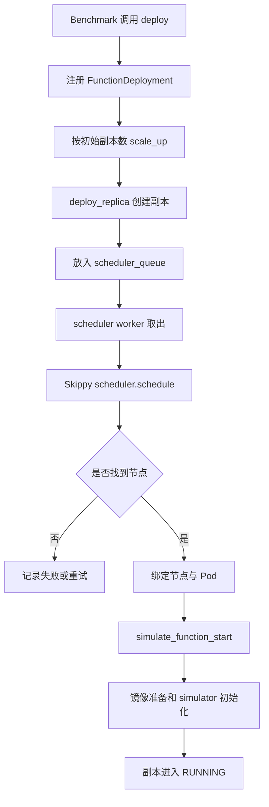
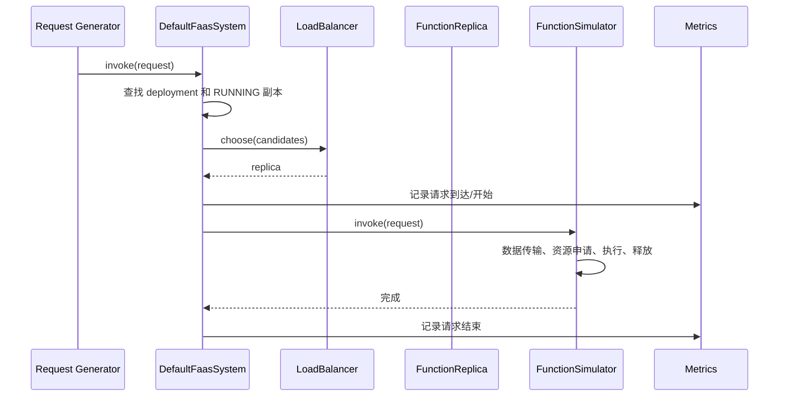

# FaaS 系统实现：`sim/faas/system.py`

## 1. 模块定位

`sim/faas/system.py` 把 `core.py` 中的静态模型变成随仿真时间变化的业务流程。其核心是 `DefaultFaasSystem`，以及一组表达启动、调用、数据传输和停止过程的 SimPy 生成器函数。

本模块是控制面：它组织状态变化和各组件协作，但不应包含某个具体函数的性能模型。

## 2. `DefaultFaasSystem` 的主要职责

`DefaultFaasSystem` 通常维护：

- 函数部署索引；
- deployment 到 replica 的关系；
- 调度等待队列；
- 可用副本查询；
- 负载均衡器；
- 部署、扩容、缩容和调用入口；
- 调度 worker 与后台控制进程。

它通过 `env` 获取 scheduler、registry、topology、metrics、resource_state 和 simulator_factory。

## 3. 部署主流程



部署入口通常不会一次性同步完成全部步骤。它会创建或唤醒多个进程，让调度和启动在事件队列中推进。

## 4. `deploy`：注册部署

`deploy` 的核心不是“启动一个容器”，而是把 deployment 纳入系统管理，并根据配置创建初始副本。阅读该方法时应检查：

1. 是否拒绝重复名称或处理重复部署；
2. deployment 何时加入索引；
3. 初始副本数如何计算；
4. 是否启动对应的伸缩进程；
5. 返回事件代表“已注册”还是“副本已经运行”。

最后一点尤其重要。异步仿真中，部署提交成功不等于容器已经可以接收请求。

## 5. `scale_up` 与 `deploy_replica`

扩容一般分两层：

- `scale_up` 决定要增加多少副本；
- `deploy_replica` 为每个副本创建运行时对象、Pod，并提交调度。

拆分后，自动伸缩器只需要请求目标数量，不需要理解 Pod 构造和调度细节。

创建副本时应保持以下一致性：

```text
deployment.replicas
FaaS 系统副本索引
Skippy Pod
调度队列
副本状态
```

其中任意一处遗漏都会造成“能查到但调度不到”或“调度了但负载均衡器看不到”的悬空状态。

## 6. 调度 worker

调度 worker 是长生命周期 SimPy 进程，通常循环执行：

```text
等待 scheduler_queue 中出现副本
  -> 取出副本
  -> 调用 Skippy 调度器
  -> 成功则绑定节点并启动
  -> 失败则按策略记录、重排或终止
```

队列使副本创建与调度解耦，也允许多个部署共享同一调度入口。worker 必须在实验开始前注册，否则副本会永久停留在等待调度状态。

## 7. `simulate_function_start`

函数启动过程通常包含：

1. 查询节点是否已有目标镜像；
2. 必要时从 registry 拉取镜像并占用网络带宽；
3. 根据 Oracle 或镜像属性模拟解压、初始化、冷启动时间；
4. 通过 `SimulatorFactory` 创建具体执行器；
5. 更新副本状态为可服务；
6. 记录启动时间和部署指标。

所有耗时都应通过 `yield` 表达。即使估计器返回了 `3.5` 秒，只有执行 `yield env.timeout(3.5)` 才会使仿真时钟前进。

## 8. 请求调用主流程



当没有可用副本时，系统应根据实现选择等待、排队或失败，不能把请求直接发送给尚未启动的副本。

### 当前 scale-from-zero 路径注意点

`invoke()` 在没有运行副本时会 `yield from poll_available_replica()`，但等待结束后当前局部变量 `replicas` 没有重新查询，随后仍按等待前的空列表判断并抛出 `ValueError`。要让该路径可用，应在轮询返回后再次执行 `get_replicas(..., RUNNING)`。

## 9. `simulate_function_invocation`

该过程提供请求执行的通用框架：

- 记录调用开始；
- 调用绑定副本的 `FunctionSimulator.invoke(request)`；
- 处理返回或异常；
- 记录调用结束和耗时。

需要特别区分：通用调用框架不会天然知道某个函数何时下载输入、何时上传输出。数据传输由具体 simulator 按函数业务语义显式触发。

## 10. 数据下载与上传

`simulate_data_download` 和 `simulate_data_upload` 负责把数据移动转换成网络流和时间事件。典型步骤：

```text
读取 Pod/函数标签中的数据位置和大小
  -> 在 storage index 中解析源或目标节点
  -> 查询 topology 路径与带宽
  -> 创建 SafeFlow
  -> 等待流完成
  -> 记录传输字节数、持续时间和异常
```

数据标签属于声明，传输过程属于运行行为。标签缺失、位置不可达或带宽不足时，应有明确的错误或降级语义。

## 11. `scale_down` 与副本停止

缩容不是简单地从列表删除对象。完整流程需要考虑：

- 选择哪个副本移除；
- 是否仍有执行中的请求；
- 何时停止接收新请求；
- 何时释放资源；
- 何时从 Skippy 集群视图删除 Pod；
- deployment、副本索引和指标如何同步更新。

合理顺序通常是：先标记不可接收新请求，再等待或处理在途请求，最后执行停止与清理。

### 当前缩容与挂起路径注意点

- `scale_down()` 在遍历待移除列表时又执行 `replicas.remove(replica)`，会改变正在迭代的列表，多个副本时可能跳过元素；
- `suspend()` 调用了生成器函数 `scale_down()`，但没有 `yield from` 或 `env.process()`，因此缩容生成器不会真正执行；
- `faas_idler` 又尝试对 `suspend()` 的返回值调用 `env.process()`，当前组合无法形成有效 SimPy 进程。

源码修改时应把 `suspend()` 明确定义为生成器并 `yield from scale_down(...)`，再由调用方通过 `env.process()` 注册。

## 12. 失败路径

本模块常见失败点包括：

- 调度器找不到可行节点；
- 镜像架构与节点不匹配；
- 镜像仓库没有对应镜像；
- 网络路径不存在或带宽不足；
- simulator factory 无法为函数创建执行器；
- 调用时没有运行副本；
- 执行器抛出异常。

源码阅读不能只跟成功路径，还应确认失败是否：更新状态、记录指标、释放已申请资源，并避免请求或副本永久挂起。

## 13. 与其他模块的协作

| 协作者 | 本模块如何使用它 |
|---|---|
| `sim.core.Environment` | 获取时钟和全局组件 |
| `sim.faas.core` | 使用 deployment、replica、request 和接口 |
| `sim.skippy` | 创建 Pod 并提交调度 |
| `sim.docker` | 拉取镜像 |
| `sim.topology` / `sim.net` | 模拟数据流 |
| `sim.resource` | 由具体 simulator 申请和释放资源 |
| `sim.metrics` | 记录部署、调度、启动和调用指标 |
| `sim.oracle` | 提供时间、带宽或资源估计 |

## 14. 常见误区

- 把提交部署事件当作副本已进入 `RUNNING`；
- 扩容时只修改副本计数，没有创建可调度 Pod；
- 调度失败后副本仍被负载均衡器选中；
- 在通用 invocation 中假设所有函数都有相同数据传输顺序；
- 停止副本时遗漏资源释放或集群视图清理；
- 捕获异常后不更新请求状态，导致上层永远等待。

## 15. 阅读检查点

- deployment 从注册到拥有可用副本经过哪些异步阶段？
- scheduler worker 为什么必须是后台进程？
- `simulate_function_invocation` 与具体 simulator 各负责什么？
- 缩容为什么不能只执行列表删除？
