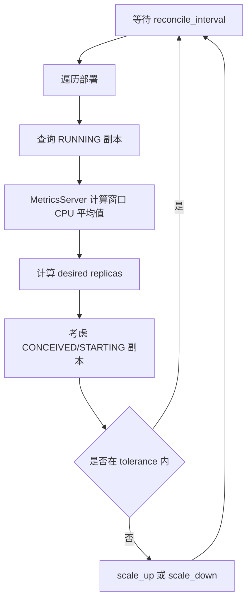

# 自动伸缩：`sim/faas/scaling.py` 与 `sim/hpa.py`

## 1. 模块定位

自动伸缩器是周期运行的控制循环。它不直接创建容器，而是读取指标、计算目标副本数，再调用 `FaasSystem.scale_up()` 或 `scale_down()`。

```text
等待一个调和周期
  -> 读取当前指标和副本状态
  -> 计算期望副本数
  -> 应用容忍区间和在途副本修正
  -> 调用 FaaS 系统扩容或缩容
  -> 进入下一周期
```

## 2. 共同术语

| 术语 | 含义 |
|---|---|
| `reconcile_interval` | 控制器重新计算决策的周期 |
| `alert_window` | 聚合请求或队列指标的观察窗口 |
| `threshold` | 触发或计算伸缩的目标值 |
| `CONCEIVED` | 已创建但尚未开始运行的副本 |
| `STARTING` | 正在拉镜像或启动的副本 |
| `RUNNING` | 可以提供服务的副本 |
| tolerance | 目标附近不执行伸缩的容忍区间 |

计算时必须关注在途副本。只统计 `RUNNING`，会在冷启动尚未完成时反复扩容，造成明显过冲。

## 3. `faas_idler`

`faas_idler` 实现空闲函数的 scale-to-zero：

1. 每隔 `reconcile_interval` 遍历部署；
2. 忽略未启用 `scale_zero` 的函数；
3. 忽略已经没有运行副本的函数；
4. 使用 `env.now - env.metrics.last_invocation[name]` 计算空闲时间；
5. 超过 `inactivity_duration` 后异步调用 `faas.suspend(name)`。

该过程依赖 `Metrics.last_invocation` 已被请求路径正确更新。新部署尚无调用记录时，需要确认指标字典是否有合理初始值，否则可能发生键不存在的问题。

当前 `DefaultFaasSystem.suspend()` 没有推进 `scale_down()` 生成器，而 `faas_idler` 把 `suspend()` 返回值交给 `env.process()`。因此现有 scale-to-zero 调用链需要修正后才能正常工作，具体见 `04_FaaS系统system.md`。

## 4. `FaasRequestScaler`

该伸缩器根据相邻观察周期之间新增的累计调用数计算近似 RPS：

```text
window_invocations = current_total - previous_total
observed_rps = window_invocations / reconcile_interval
```

当 RPS 达到阈值时扩容，否则缩容。单次调整量由配置中的 `scale_factor` 和 `scale_max` 共同计算。

这是较直接的阈值策略，优点是逻辑简单；局限是低于阈值就缩容，若没有冷却时间或最小副本约束，容易在阈值附近反复变化。

## 5. `AverageFaasRequestScaler`

该控制器先计算观察窗口中每个运行副本平均承担的请求数，再使用 HPA 风格公式：

```text
average = window_invocations / running_replicas
desired = ceil(running_replicas * average / target_average_rps)
```

其关键保护机制：

- 没有运行副本时跳过本轮，避免除零；
- 将 `CONCEIVED` 和 `STARTING` 副本纳入二次估计，减少过度扩容；
- 在目标值上下的容忍区间内不做调整，减少抖动；
- 最终只把目标值与当前运行副本数之差交给 FaaS 系统。

注意：变量名是 `target_average_rps`，但源码窗口统计的是请求数量，是否需要除以窗口时长取决于配置对该字段的实际定义。设置实验参数时必须与实现口径一致。

## 6. `AverageQueueFaasRequestScaler`

该伸缩器读取每个运行副本的 `simulator.queue.queue` 长度，并使用中位数代表当前压力：

```text
queue_metric = ceil(median(queue_lengths))
desired = ceil(running_replicas * queue_metric / target_queue_length)
```

使用中位数可以降低单个异常长队列对整体决策的影响。对正在启动的副本，算法临时补入队列长度 `0`，表示这些副本很快会分担压力。

该实现与具体 simulator 存在结构耦合：simulator 必须提供含 `queue` 属性的 `simpy.Resource`。如果给普通 `FunctionSimulator` 启用此伸缩器，会出现属性错误。因此它更像特定执行模型的策略，而不是对所有 simulator 都通用的控制器。

## 7. `HorizontalPodAutoscaler`

`sim/hpa.py` 根据 `MetricsServer` 提供的平均 CPU 利用率伸缩：

```text
average_cpu = sum(replica_average_cpu) / running_replicas
desired = ceil(running_replicas * average_cpu / target_average_utilization)
```

完整流程：



### 源码阅读注意点

构造函数接收 `average_window`，但当前实现把 `self.average_window` 固定赋值为 `100`。因此传入其他窗口值不会生效。这是阅读和修改 HPA 时应明确的现状。

## 8. 控制器的启动与停止

这些 `run()` 方法是生成器，必须注册成 SimPy 进程：

```python
scaler = AverageFaasRequestScaler(deployment, env)
process = env.process(scaler.run())
```

三个 FaaS scaler 通过 `running` 字段和 `stop()` 停止；HPA 的 `run()` 是无限循环，当前没有对应停止开关，一般由仿真结束统一终止。

## 9. 选择策略

| 场景 | 更合适的指标 |
|---|---|
| 到达负载直接可观测且执行时间稳定 | 请求速率 |
| 每个副本期望承担固定吞吐 | 平均请求数/RPS |
| worker 并发受限且排队是主要问题 | 队列长度 |
| CPU 是主要瓶颈且资源采样可信 | HPA CPU 利用率 |
| 长时间无请求需要节约资源 | `faas_idler` |

## 10. 常见误区

- 把累计请求数直接当作当前窗口请求数；
- 忽略正在启动的副本导致连续扩容；
- 指标窗口与控制周期单位不一致；
- 目标值为零导致除零；
- 队列伸缩器配给不具有 `queue` 的 simulator；
- 控制器进程未通过 `env.process` 启动；
- 伸缩计算未受到 deployment 的最小/最大副本约束保护。

## 11. 阅读检查点

- 每个伸缩器读取的指标来自哪里？
- 为什么要把正在启动的副本纳入估算？
- 容忍区间如何减少副本抖动？
- 请求数量、请求速率和队列长度是否使用了相同单位？
