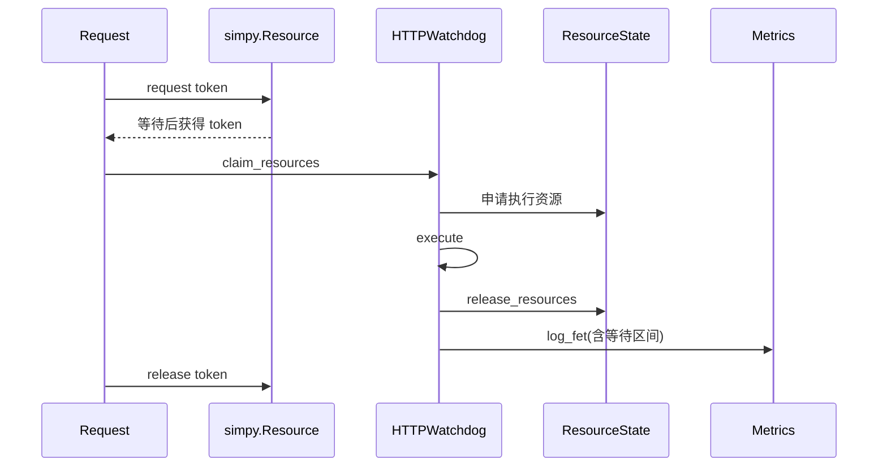

# Watchdog 函数执行模型：`sim/faas/watchdogs.py`

## 1. 模块定位

Watchdog 位于 FaaS 通用调用框架与具体函数性能模型之间。它把一次调用拆成三个可替换阶段：

```text
claim_resources -> execute -> release_resources
```

子类再决定请求是否需要等待 worker、允许多少并发，以及如何记录等待时间。

## 2. `Watchdog` 抽象接口

### `claim_resources(env, replica, request)`

申请本次调用需要的 CPU、内存、GPU 或其他资源。实现通常通过 `env.resource_state` 修改资源账本。若资源申请需要等待，该方法应以生成器事件表达等待过程。

### `execute(env, replica, request)`

模拟函数主体执行。具体实现可查询 Oracle、计算退化系数，并使用 `yield env.timeout(duration)` 推进执行时间。

### `release_resources(env, replica, request)`

释放本次调用占用的资源。释放必须与申请成对，异常路径也不能遗漏，否则后续请求会看到永久占用。

基类中的省略号只是协议占位，不提供可直接使用的资源或执行逻辑。

## 3. `ForkingWatchdog`

`ForkingWatchdog.invoke()` 对每个请求执行以下顺序：

```text
把请求加入 node.current_requests
  -> 记录 FET 起点
  -> claim_resources
  -> execute
  -> release_resources
  -> 记录 FET 终点与指标
  -> 从 current_requests 移除请求
```

“Forking”模式没有额外的 worker token 池。每个请求内部按申请、执行、释放顺序进行，但多个请求进程能否并发，取决于上层如何启动调用以及资源申请实现，而不是由该类显式串行化。

## 4. `HTTPWatchdog`

`HTTPWatchdog` 使用 `simpy.Resource` 模拟固定大小的 worker 池。

### 4.1 `workers`

`workers` 表示同一副本可同时处理的请求数，也是资源池容量。

### 4.2 `setup()`

副本启动时创建资源池：

```python
self.queue = simpy.Resource(env, capacity=self.workers)
```

若没有调用 `setup()`，`queue` 仍为 `None`，后续 `invoke()` 无法申请 token。因此 simulator 生命周期必须保证 setup 先于请求到达。

### 4.3 `invoke()`



FET 指标同时接收 `t_wait_start` 和 `t_wait_end`，因此可以区分：

- worker 排队等待时间；
- 真正拿到 worker 后的函数执行时间；
- 请求端到端时间。

## 5. `node.current_requests`

请求执行期间会加入副本所在节点的 `current_requests` 集合。该集合可用于：

- 性能退化模型构造并发输入；
- 调试节点当前工作负载；
- 统计并发度；
- 解释某次执行为何变慢。

完成后必须移除。若 `claim_resources` 或 `execute` 抛出异常，当前代码的顺序可能跳过后续释放和移除；扩展实现时建议使用能够保证清理的控制结构。

## 6. 继承组合方式

Watchdog 只规定并发外壳，具体函数模拟器仍需提供三个阶段。例如：

```python
class MyHttpSimulator(HTTPWatchdog):
    def claim_resources(self, env, replica, request):
        yield from env.resource_state.claim(...)

    def execute(self, env, replica, request):
        duration = ...
        yield env.timeout(duration)

    def release_resources(self, env, replica, request):
        yield from env.resource_state.release(...)
```

如果项目已有 mixin 或标准资源助手，应复用它们，避免各 simulator 对资源单位和指标口径做出不同解释。

## 7. Forking 与 HTTP 模型对比

| 对比项 | `ForkingWatchdog` | `HTTPWatchdog` |
|---|---|---|
| 显式 worker 上限 | 无 | 有，等于 `workers` |
| 请求排队位置 | 资源申请或外部逻辑 | `simpy.Resource` 队列 |
| 记录 worker 等待区间 | 否 | 是 |
| 队列伸缩器兼容性 | 通常不直接兼容 | 可读取 `queue.queue` |
| 适合场景 | 每请求独立进程或自定义资源并发 | 固定 worker 数的 HTTP 服务 |

## 8. 常见误区

- 把 `simpy.Resource` 当成 CPU 资源；这里它主要代表 worker token；
- 创建 `HTTPWatchdog` 后忘记执行 `setup()`；
- `execute()` 只计算时长但没有 `yield env.timeout(...)`；
- 资源申请和释放数量不一致；
- 异常路径留下 `current_requests` 或 worker token；
- 将 worker 排队时间重复计入函数执行时间。

## 9. 阅读检查点

- Watchdog 与 `FunctionSimulator` 是什么关系？
- HTTP 模型的并发上限由哪个对象保证？
- FET 的等待时间与执行时间如何分开记录？
- 为什么 `current_requests` 对退化模型很重要？
