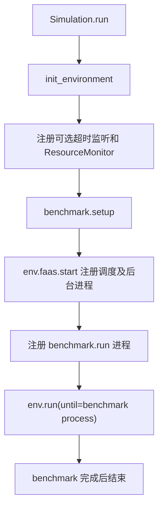

# 仿真实验装配：`sim/faassim.py`

## 1. 模块定位

`sim/faassim.py` 是完整仿真的组合根。它创建并连接 Environment、拓扑、镜像仓库、FaaS 系统、调度器、资源监控、指标系统和 benchmark，然后推进事件队列。

这里适合回答“整个程序如何启动”，不适合堆放某个函数的业务模型。

## 2. `Simulation`

### 2.1 构造参数

`Simulation(topology, benchmark, env=None, timeout=None, name=None)` 接收：

- `topology`：节点与网络结构；
- `benchmark`：实验工作负载；
- `env`：可选的预构造环境；
- `timeout`：可选的真实运行时间限制，由 `timeout_listener` 周期检查；
- `name`：实验名称。

允许传入环境便于测试和定制；未提供时由仿真创建标准 `Environment`。

### 2.2 `run()` 生命周期



判断 `run()` 是否正确，重点检查三个边界：

1. 所有组件是否在使用前装配；
2. 生成器是否注册为 SimPy 进程；
3. 仿真结束条件是否能覆盖 benchmark 和后台进程。

## 3. `init_environment()`

该方法把外部输入转成一个可运行环境，典型工作包括：

- 绑定拓扑和集群视图；
- 创建容器 registry；
- 创建 simulator factory；
- 创建 `DefaultFaasSystem`；
- 创建 Skippy scheduler；
- 初始化 metrics、resource state、metrics server 和 monitor；
- 保留调用方已经注入的同类组件，不重复覆盖。

节点运行时状态由 `Environment.get_node_state()` 延迟创建；资源监控在 `run()` 中注册，调度 worker 和 `env.background_processes` 则由 `env.faas.start()` 注册。

它体现了依赖创建顺序。例如 scheduler 依赖 cluster context，FaaS 启动流程依赖 registry 和 simulator factory。`env.run(until=p)` 只等待 benchmark 主进程；无限循环后台进程不会阻止实验在 benchmark 完成后退出。

## 4. 工厂方法

### `create_container_registry()`

创建镜像仓库。子类可重写它来提供不同镜像清单、镜像大小或架构属性。

### `create_simulator_factory()`

默认返回简单 simulator 工厂。实验要使用函数专属执行模型时，通常重写该方法比修改 `Simulation.run()` 更合适。

### `create_faas_system(env)`

创建 FaaS 控制面。可用于注入自定义负载均衡器、控制策略或系统实现。

### `create_scheduler(env)`

创建并配置 Skippy 调度器。调度谓词、优先级和上下文都应在这个边界装配。

这些方法形成模板方法模式：`run()` 保持稳定，子类通过少数创建钩子替换组件。

## 5. `BadPlacementException`

该异常表达副本放置不合法或调度结果无法应用。它应与“没有镜像”“请求执行失败”等异常区分，因为它属于部署/调度阶段。

源码中它继承 `BaseException` 而不是通常的 `Exception`。这意味着常见的 `except Exception` 不会捕获它，调用方必须明确理解这一行为。

## 6. `DummySimulator`

`DummySimulator` 实现 `FunctionSimulator` 的生命周期骨架：

- `deploy`：部署准备；
- `startup`：启动延迟；
- `setup`：运行前初始化；
- `invoke`：处理请求；
- `teardown`：副本销毁清理。

它适合验证控制流程，但如果各阶段几乎没有耗时或资源行为，不能代表真实函数性能。

## 7. `DockerDeploySimMixin`

该 mixin 为 simulator 增加镜像部署行为。部署时通过 registry、节点缓存和网络模型模拟镜像拉取。

Mixin 不负责成为完整 simulator，它只提供一个可组合能力。使用多重继承时要检查方法解析顺序（MRO），确保最终调用的是预期 `deploy()`。

## 8. `ModeledExecutionSimMixin`

该 mixin 从 Oracle 或性能模型获取执行时间，并通过 SimPy timeout 表达函数运行过程。核心语义是：

```text
查执行时间模型 -> 得到 duration -> yield env.timeout(duration)
```

如果还需要资源申请、数据传输和退化，必须确认这些阶段由该 mixin、其他 mixin 或具体子类中的谁负责，避免重复计算。

## 9. `SimpleFunctionSimulator`

该类组合：

```python
class SimpleFunctionSimulator(
    ModeledExecutionSimMixin,
    DockerDeploySimMixin,
    DummySimulator,
):
    ...
```

它通过多重继承获得“模型化执行 + Docker 部署 + 默认生命周期”。阅读时要按 MRO 查找每个方法最终来自哪个父类，而不是只看类体是否为空。

## 10. `SimpleSimulatorFactory`

工厂的 `create(env, fn)` 接收函数容器定义并返回 simulator。默认实现适合统一的简单模型；复杂实验通常根据函数名、镜像标签或运行时类型返回不同子类。

## 11. 自定义仿真的推荐方式

```python
class MySimulation(Simulation):
    def create_simulator_factory(self):
        return MySimulatorFactory()

    def create_scheduler(self, env):
        return build_my_scheduler(env)
```

保持 `run()` 主流程不变，可以避免遗漏监控、后台进程或结束条件。

## 12. 常见误区

- benchmark 尚未 setup 就开始 run；
- 只创建 scheduler，却没有启动处理调度队列的 worker；
- 自定义环境缺少 registry、metrics 或 resource_state；
- 多重继承顺序改变后，mixin 方法未被调用；
- Dummy simulator 被误用于需要真实资源竞争结论的实验；
- 把 `timeout` 误认为 `env.now` 上限；当前监听器比较的是真实墙钟时间。

## 13. 阅读检查点

- `Simulation` 为什么被称为组合根？
- 哪些方法是推荐的组件替换钩子？
- `SimpleFunctionSimulator` 的行为为什么不能只看类体？
- 一个 benchmark 在什么时候 setup、什么时候作为进程运行？
