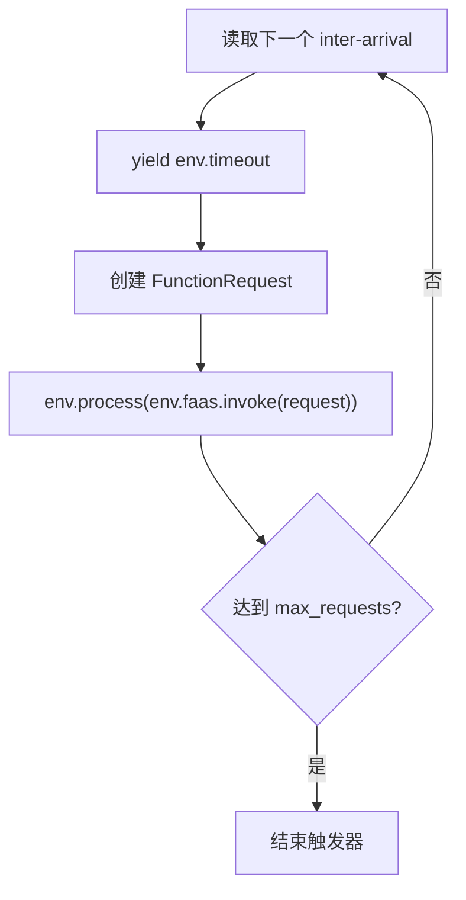

# Benchmark 与请求生成：`sim/benchmark.py`、`sim/requestgen.py`

## 1. 模块定位

这两个模块共同定义实验负载：

- `benchmark.py` 描述实验要注册哪些镜像、部署哪些函数、启动哪些请求流；
- `requestgen.py` 描述请求在什么时间到达。

将实验编排与到达数学模型分开，可以复用同一负载生成器测试不同函数和调度策略。

## 2. `Benchmark` 协议

### `setup(env)`

用于仿真开始前的同步准备，例如注册数据、建立配置或检查输入。它不应依赖尚未启动的后台进程完成异步工作。

### `run(env)`

实验主生成器，负责部署函数、等待副本就绪、启动请求发生器并等待实验结束。调用后必须注册到环境：

```python
env.process(benchmark.run(env))
```

## 3. `BenchmarkBase`

`BenchmarkBase` 为常见实验提供基础实现，构造参数组织三类输入：

- 镜像及其属性；
- `FunctionDeployment` 列表；
- 请求到达配置或请求生成器。

### `register_images(env)`

把镜像属性写入 `env.container_registry`。这一步必须在副本启动前完成，否则拉取镜像时无法找到大小、架构等信息。

### deployment 索引

私有方法按函数名整理 deployment，便于请求配置与目标函数对应。函数名是多个模块的关联键，因此应避免重复、拼写不一致或请求配置指向不存在的名称。

### `run(env)` 的典型结构

```text
部署所有函数
  -> 等待部署相关进程
  -> 启动每个函数的请求触发器
  -> 等待请求流完成
  -> 结束 benchmark
```

### `wait(env, ps)`

用于等待一组 SimPy 进程。与 Python 线程 `join()` 不同，这里等待的是离散事件，必须通过 `yield` 交还控制权。

## 4. `DegradationBenchmarkBase`

该类在基础 benchmark 上增加性能退化模型装配。`setup()` 除标准准备外，还会从文件读取节点模型并写入环境或节点状态。

辅助函数：

- `get_model_file(folder, node_name)`：定位节点对应模型文件；
- `set_degradation(env, folder)`：遍历节点并加载退化模型。

模型文件名、节点名和拓扑节点必须严格对应。缺失模型时应明确选择报错、跳过还是使用默认模型，不能悄悄把“无模型”解释为“无退化”。

## 5. RPS profile

RPS profile 生成“当前阶段每秒请求数”。

### `constant_rps_profile(rps)`

持续产生固定 RPS，适合稳态基线和容量测试。

### `sine_rps_profile(env, max_rps, period)`

根据正弦曲线产生周期负载，适合观察伸缩器对规律波峰和波谷的响应。

### `randomwalk_rps_profile(mu, sigma, max_rps, min_rps=0)`

使用随机游走生成变化负载，并限制在最小、最大边界内。适合模拟不可预测但连续变化的业务流量。

随机实验应固定 NumPy/Python 随机种子，并把种子记录到实验输出中，否则结果难以复现。

## 6. Arrival profile

arrival profile 把 RPS 转换成相邻请求的到达间隔（inter-arrival time）。

### `static_arrival_profile`

使用近似固定间隔：

```text
inter_arrival = 1 / rps
```

适合均匀到达。RPS 为零时应产生无限等待或无请求语义，不能直接除零。

### `expovariate_arrival_profile`

按指数分布采样到达间隔，常用于模拟泊松到达过程。平均 RPS 相同，但请求到达会比固定间隔更有突发性。

### `pre_recorded_profile(file)`

从文件读取已记录的到达序列。适合重放真实轨迹或确保多组实验使用完全相同的负载。

必须明确文件记录的是“绝对到达时间”还是“相邻到达间隔”，并保持单位一致。

## 7. `function_trigger`

这是请求生成到 FaaS 调用的连接点：



触发器通常不等待上一个请求完成后再产生下一个请求，否则到达流会错误地受函数执行时间限制。它应把每次调用注册为独立进程。

## 8. `run_arrival_profile`

该函数在指定 `until` 时间内运行到达 profile，并生成事件时间序列。它适合预览负载、测试 profile 或为绘图准备数据，而不必运行完整 FaaS 仿真。

## 9. `save_requests`

`save_requests(profile, duration, file, env=None)` 把到达过程保存到文件，常用于：

- 固化一次随机生成的工作负载；
- 在不同调度算法间复用同一请求序列；
- 单独检查负载曲线是否符合预期。

输出文件应包含明确单位和顺序，并在覆盖已有文件时由实验代码做出显式决定。

## 10. 如何验证负载是否正确

建议至少检查：

1. 请求数是否与时长和平均 RPS 大致一致；
2. 到达时间是否单调递增；
3. 相邻间隔是否非负；
4. 峰值是否超过配置上限；
5. 随机种子固定后是否可复现；
6. profile 输出单位是否与 `env.timeout()` 一致；
7. `max_requests` 与实验结束时间谁先终止负载。

## 11. 绘图建议

负载图应展示实际到达行为，而不只展示理论 RPS 函数：

- 横轴使用仿真时间；
- 主图绘制固定时间桶内的实际请求数/RPS；
- 可叠加理论目标 RPS，但应使用不同线型并标注；
- 随机 profile 可增加滚动平均，保留原始曲线的透明细线；
- 多算法比较必须复用同一预记录请求文件。

## 12. 常见误区

- 把 RPS 生成器的输出直接当成到达间隔；
- 等待每次 invoke 完成后才创建下一请求；
- 指数分布参数使用错误，导致均值颠倒；
- benchmark 部署未就绪就开始发送负载；
- 随机实验未固定种子；
- 保存轨迹和读取轨迹对时间单位理解不一致。

## 13. 阅读检查点

- `setup()` 和 `run()` 的职责为什么要分开？
- RPS profile 与 arrival profile 有什么区别？
- `function_trigger` 为什么要把调用注册成独立进程？
- 如何保证两种调度算法收到完全相同的请求负载？
