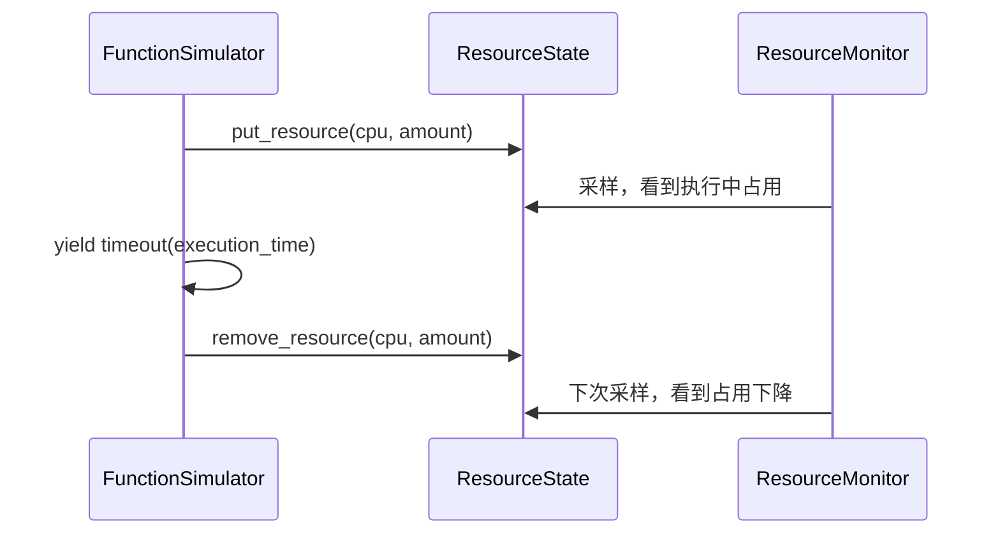

# 资源状态与监控：`sim/resource.py`

## 1. 模块定位

本模块把函数执行期间的资源变化保存成可查询状态，并周期采样形成历史窗口。

```text
FunctionSimulator 申请/释放资源
        |
        v
ResourceState 当前状态
        |
        v
ResourceMonitor 周期采样
        +------------------+
        v                  v
MetricsServer 历史窗口   Metrics 结构化输出
```

这里必须区分：`ResourceState` 是当前值，`MetricsServer` 是历史采样，节点 `capacity` 是静态上限。

## 2. `ResourceUtilization`

该类用 `Dict[str, float]` 保存一组资源数值，例如：

```text
cpu      -> 250
memory   -> 134217728
gpu      -> 0.5
network  -> ...
```

主要方法：

- `put_resource(resource, value)`：在现有数值上累加；
- `remove_resource(resource, value)`：扣减数值；
- `get_resource(resource)`：读取单项资源；
- `list_resources()`：返回深拷贝快照；
- `copy()`：复制为独立对象；
- `is_empty()`：判断是否从未登记资源键。

`remove_resource()` 不校验结果是否为负数。因此申请与释放的调用方必须保证数量和次数一致。

## 3. `NodeResourceUtilization`

节点级对象按 Pod 名保存每个副本的 `ResourceUtilization`，并保留 Pod 名到 `FunctionReplica` 的引用。

```text
node
├── pod-a -> replica-a -> {cpu, memory, ...}
├── pod-b -> replica-b -> {cpu, memory, ...}
└── total_utilization   -> 所有副本同名资源求和
```

`get_resource_utilization(replica)` 采用延迟创建：副本第一次申请或查询资源时才建立空记录。

`total_utilization` 每次创建新的聚合对象，不直接暴露内部字典，适合监控采样时取得一致快照。

## 4. `ResourceState`

`ResourceState` 是全局资源账本，按节点名组织节点级对象：

```text
node_name -> NodeResourceUtilization -> pod_name -> ResourceUtilization
```

公开入口包括：

- `put_resource(replica, resource, value)`；
- `remove_resource(replica, resource, value)`；
- `get_resource_utilization(replica)`；
- `list_resource_utilization(node_name)`；
- `get_node_resource_utilization(node_name)`。

节点名由 `replica.node.name` 获取，所以副本必须已经完成调度并绑定节点后才能正确记账。

## 5. 资源申请与释放的正确时序



如果申请和释放之间没有任何监控采样点，历史指标可能看不到这次短调用。采样间隔决定了时间分辨率。

## 6. `ResourceWindow`

`ResourceWindow` 是资源历史中的单个采样点，字段为：

- `replica`：被采样副本；
- `resources`：资源名到数值的快照；
- `time`：采样时的仿真时间。

虽然名称中有 Window，当前结构表示带时间戳的快照；查询端通过多个快照构成时间窗口。

## 7. `MetricsServer`

`MetricsServer` 按“节点名 -> Pod 名”保存 `ResourceWindow` 列表。

### 平均资源查询

`get_average_resource_utilization(replica, resource, window_start, window_end)` 筛选指定时间范围内的样本，然后计算平均值。

`get_average_cpu_utilization(...)` 在平均 CPU 使用量基础上除以节点 `cpu_millis`，得到利用率比例。

调用方应明确传入的是窗口起止时间，而不是单个“窗口长度”。当前 `HorizontalPodAutoscaler.run()` 只传入了一个 `average_window` 参数，与这里需要 `window_start, window_end` 的签名不一致，是现有源码中的接口错配。

## 8. `ResourceMonitor`

监控器按 `reconcile_interval` 周期运行：

1. 等待下一个采样时刻；
2. 遍历 FaaS 的运行中副本；
3. 从 `ResourceState` 获取副本资源快照；
4. 创建 `ResourceWindow` 写入 `MetricsServer`；
5. 可选地记录函数级资源指标；
6. 聚合各节点总占用并记录节点级指标。

只有注册为进程后才会采样：

```python
monitor = ResourceMonitor(env, reconcile_interval=1)
env.process(monitor.run())
```

## 9. 资源单位

本项目常见约定是 CPU 使用 millicores、内存使用字节，但字典本身不携带单位。新增资源类型时必须统一：

- 资源申请值；
- 节点容量值；
- Metrics 利用率换算；
- Oracle 输出；
- 图表轴标签。

任何一处将 CPU 核数与 millicores 混用，都会造成一千倍误差。

## 10. 常见误区

- 将 `ResourceState` 当作调度器静态资源请求；
- 副本尚未绑定节点就登记资源；
- 释放量大于申请量产生负值；
- 直接修改 `list_resources()` 返回值，误以为会更新内部状态；
- 采样间隔过大，却用结果分析短请求峰值；
- HPA 查询窗口参数与 `MetricsServer` 签名不一致；
- 已删除副本的历史窗口被误解为当前占用。

## 11. 阅读检查点

- 当前资源、历史采样和节点容量分别由谁保存？
- 为什么资源快照需要复制？
- 采样周期如何影响指标真实性？
- 资源申请与释放在哪里保证成对？
