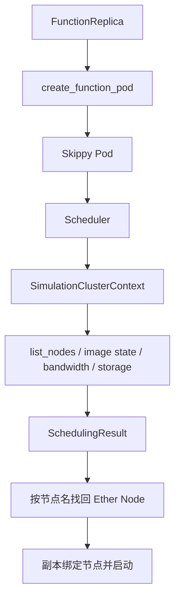

# 拓扑与 Skippy 适配：`sim/topology.py`、`sim/skippy.py`

## 1. 模块定位

项目同时使用两套视图：

- Ether 描述网络节点、连接、路由和流量；
- Skippy 描述调度需要的 Node、Pod、容量、镜像与存储信息。

适配层必须保证两边的节点名、架构、容量和标签一致。

## 2. `Topology`

`Topology` 继承 Ether topology，并补充项目需要的便捷能力。

### `DockerRegistry`

模块级 `DockerRegistry = Node('registry')` 表示镜像仓库网络端点。它是拓扑节点，不是保存镜像元数据的 `ContainerRegistry`。

```text
DockerRegistry Node  = 镜像从哪里传输
ContainerRegistry    = 有哪些镜像、大小和架构
```

### `init_docker_registry()`

确保 registry 节点存在，并把外部 internet 节点连接到 registry，使镜像拉取能够得到可路由路径。

### `find_node(node_name)`

按名称查找 Ether Node，并缓存结果。拓扑构建完成后再查询最稳妥；若运行期间动态替换同名节点，缓存可能仍指向旧对象。

### `route_by_node_name(source, destination)`

先解析两端节点，再调用 Ether 路由。节点不存在时显式抛出错误，避免把名字错误误判成“带宽很低”。

## 3. `LazyBandwidthGraph`

Skippy Oracle 希望用二维下标读取带宽：

```python
bw = graph[source][destination]
```

`LazyBandwidthGraph` 通过内部 `_Resolver` 延迟到第二次下标访问时才计算路由，并缓存结果。

跨节点带宽取整条路径最小链路带宽：

```text
path_bandwidth = min(link.bandwidth for link in route.hops)
```

同节点通信返回固定本地带宽 `1.25e8`。无路径时返回 `None`，调用方应明确处理。

## 4. `SimulationClusterContext`

该类实现 Skippy `ClusterContext`，把仿真环境暴露给调度器。主要字段包括：

- `env`、`topology`；
- `container_registry`；
- 延迟创建的 `bw_graph`；
- Skippy 节点缓存 `nodes`；
- `storage_index`；
- 存储节点缓存 `_storage_nodes`。

## 5. 镜像状态适配

### `retrieve_image_state(image_name)`

从 `ContainerRegistry` 找出镜像条目，转换为 Skippy `ImageState` 的“架构 -> 大小”映射。

若镜像未声明架构，当前实现把相同大小复制给多种常见架构；若声明架构，则只保留明确条目。

这影响两个调度判断：

- 节点架构是否能运行镜像；
- 若节点未缓存镜像，需要传输多少数据。

## 6. 节点适配

### `to_skippy_node(node)`

把 Ether Node 转成 Skippy Node，通常映射：

- 名称；
- CPU、内存等容量；
- 架构和 locality 标签；
- 调度所需附加属性。

Ether Node 负责网络身份，Skippy Node 负责调度身份；节点名称是两者重新关联的关键。

### `list_nodes()`

遍历拓扑计算节点并转换成 Skippy 节点列表，排除 registry、网络交换节点等不可运行 Pod 的对象。列表被缓存，动态修改拓扑后需要考虑缓存失效。

## 7. Pod 适配

### `create_function_pod(fd, fn)`

把 `FunctionDeployment` 与具体 `FunctionContainer` 转换成 Skippy Pod：

```text
函数名/计数器 -> Pod 名
容器镜像       -> Container.image
资源需求       -> ResourceRequirements
函数标签       -> PodSpec.labels
```

Pod 标签还可能承载数据传输、伸缩或调度信息。标签键一旦改变，`system.py`、Oracle 和 Skippy 插件中的读取逻辑必须同步。

## 8. 存储节点接口

`storage_nodes()`、`is_storage_node()` 和 `get_next_storage_node()` 为数据局部性策略提供信息。`StorageIndex` 描述数据所在位置，拓扑描述位置之间如何传输。

随机选择下一个存储节点会引入实验随机性；比较算法时应固定随机种子或提供确定性选择策略。

## 9. 调度完整路径



## 10. 常见误区

- 混淆网络 registry 节点与镜像元数据仓库；
- Ether 和 Skippy 节点名称不一致；
- 容量单位在转换时丢失；
- 修改拓扑后继续使用旧节点或带宽缓存；
- Pod 标签修改后数据传输逻辑未同步；
- 无路由返回 `None` 后仍参与数值运算；
- 把非计算网络节点暴露给调度器。

## 11. 阅读检查点

- 为什么项目需要 Ether 和 Skippy 两套节点对象？
- 镜像大小如何从 registry 进入调度决策？
- `graph[a][b]` 为什么能延迟计算？
- 调度结果如何重新绑定到仿真中的 Ether Node？
