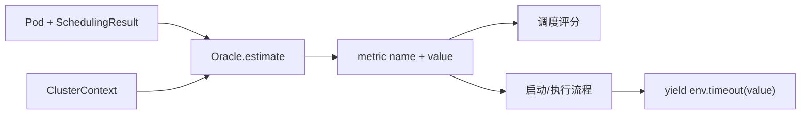

# Oracle 估计体系：`sim/oracle/`

## 1. 对应源码

- `sim/oracle/__init__.py`：Oracle 子包入口；
- `sim/oracle/oracle.py`：接口、经验估计器和拟合估计器；
- `sim/oracle/data/__init__.py`：模型数据子包入口；
- `sim/oracle/data/distributions.py`：启动时间和执行时间的拟合分布参数表。

## 2. 模块定位

Oracle 为调度和执行流程提供可替换的估计值。统一接口接收：

- `ClusterContext`：集群、镜像、带宽和存储视图；
- `Pod`：待调度工作负载；
- `SchedulingResult`：候选或最终节点及所需镜像。

返回形式通常是 `(metric_name, string_value)`，便于作为 Skippy Oracle 特征使用。

Oracle 只计算或采样数值，不直接推进 SimPy 时间、不申请资源，也不修改副本状态。

## 3. `Oracle`

基类定义 `estimate(context, pod, scheduling_result)` 协议。自定义实现应保持：

- 无可用调度节点时返回明确的 `None` 值；
- metric name 稳定；
- 单位固定；
- 对缺失标签、镜像和模型有明确处理；
- 随机采样可通过种子复现。

## 4. `EmpiricalOracle`

经验型 Oracle 从观测数据文件加载样本，通常使用 Pandas 根据主机、镜像、带宽和缓存状态筛选记录，再从匹配行中抽样。

优点：保留真实数据分布；局限：输入组合未在数据中出现时无法自然外推。

## 5. `StartupTimeOracle`

启动时间通常由以下因素决定：

- 目标主机类型；
- 容器镜像；
- 节点是否已有镜像；
- registry 到节点的带宽；
- 多容器 Pod 中各容器启动成本。

返回的 `startup_time` 仍只是数值，启动流程需要自行 `yield env.timeout(value)`。

## 6. `ExecutionTimeOracle`

执行时间 Oracle 根据主机类型、镜像以及数据/带宽条件从经验数据中采样。多容器 Pod 的执行时间在当前实现中按容器累加。

要检查经验数据使用的时间单位是否与仿真秒一致。

## 7. `BandwidthUsageOracle`

该 Oracle 估计调度一个 Pod 引起的数据传输总量，包括：

- `SchedulingResult.needed_images` 对应的镜像大小；
- `data.skippy.io/receives-from-storage` 标签；
- `data.skippy.io/sends-to-storage` 标签。

它估算的是数据量，不是可用带宽或传输时长。调度策略可用它偏好少传输的节点。

## 8. `CostOracle`

成本 Oracle 组合执行时间 Oracle，在 cloud 类型节点上按固定费率估算费用；edge 节点当前返回零成本。

这种成本模型适合相对比较，但费率常数、计费粒度和资源维度是模型假设，不能直接当作真实云厂商账单。

## 9. `ResourceUtilizationOracle`

该类根据 Pod 请求占节点容量的比例计算资源分数：

```text
score = requested_memory / node_memory
      + requested_cpu / node_cpu_millis
```

当前只对 locality 类型为 `edge` 的节点计算，其他节点返回零。该分数表示拟放置负载的相对资源占用，不等于 `ResourceState` 采样到的实时执行利用率。

## 10. 拟合分布 Oracle

### `FittedStartupTimeOracle`

根据 `(host_type, image, image_present, bandwidth)` 选择预定义分布采样器。采样器通过缓冲和有界拒绝采样把结果限制在观测范围内。

### `HackedFittedStartupTimeOracle`

这是带历史兼容修正的启动时间实现。它使用固定带宽拆分下载部分，并通过较宽松的镜像键匹配采样器。名称本身提示它不是通用设计，新增实验前应确认这些修正仍符合目标场景。

### `FittedExecutionTimeOracle`

按 `(host_type, image)` 选择拟合分布，采样函数执行时间。没有对应键时显式抛出 `ValueError`，说明当前模型不覆盖该主机/镜像组合。

### `data/distributions.py`

该文件保存 `startup_time_distributions` 和 `execution_time_distributions` 等拟合结果。映射键必须与 Oracle 构造的主机类型、镜像名、缓存状态和带宽键完全一致；值通常包含采样下界、上界和分布对象。修改节点命名或镜像命名规则后，应同步检查这里的键。

## 11. `FetOracle` 与 `ResourceOracle`

这两个是更直接的业务查询协议：

- `FetOracle.sample(host, image)` 返回函数执行时间样本；
- `ResourceOracle.get_resources(host, image)` 返回函数资源画像。

它们不要求完整 Skippy `Pod` 和 `SchedulingResult`，适合具体 simulator 在执行阶段使用。

## 12. 经验模型与拟合模型对比

| 对比项 | 经验采样 | 拟合分布 |
|---|---|---|
| 数据来源 | 原始观测表 | 预先拟合参数 |
| 是否保留离散样本 | 是 | 否 |
| 未见组合处理 | 通常失败或空 | 仍需存在分布键 |
| 运行开销 | 查询 DataFrame | 采样器查询 |
| 可复现性 | 依赖采样随机种子 | 同样依赖随机种子 |
| 适用场景 | 精确重放观测分布 | 轻量模拟与大量采样 |

## 13. Oracle 接入路径



同一个估计值不要同时被调度评分和实际执行流程重复当作耗时累加。评分读取它不会推进时间，执行流程使用它时才推进。

## 14. 模型数据管理

模型文件和分布表应记录：

- 数据版本与采集来源；
- 主机类型命名规则；
- 镜像名称是否含 tag；
- 时间、大小、带宽和资源单位；
- 拟合分布、上下界和随机种子；
- 缺失组合的回退策略。

## 15. 常见误区

- Oracle 返回时间后忘记通过 timeout 推进仿真；
- 调度评分阶段意外修改环境状态；
- 主机名切片规则与实际命名不一致；
- 镜像名有时含 tag、有时不含；
- 将数据量 Oracle 误当作带宽 Oracle；
- 经验数据缺失时静默返回零；
- 没有固定随机种子却比较两种策略；
- 把请求资源比例当作实时 CPU 使用率。

## 16. 阅读检查点

- Oracle 为什么不能直接调用 `env.timeout()`？
- 启动、执行、数据量和资源分数分别依赖哪些输入？
- 经验采样与拟合分布各有哪些偏差来源？
- `ResourceUtilizationOracle` 与 `ResourceState` 有什么本质区别？
