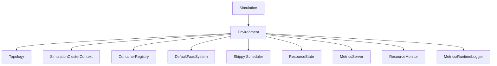
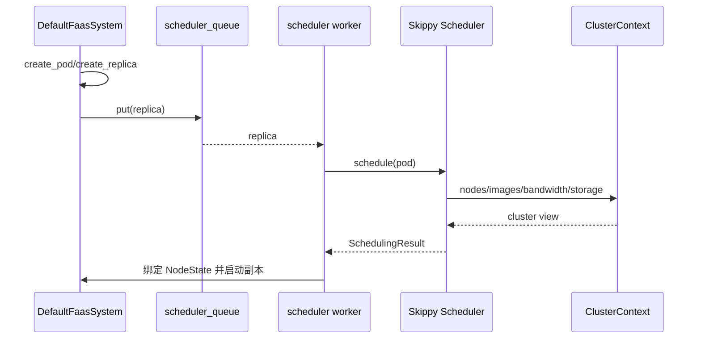
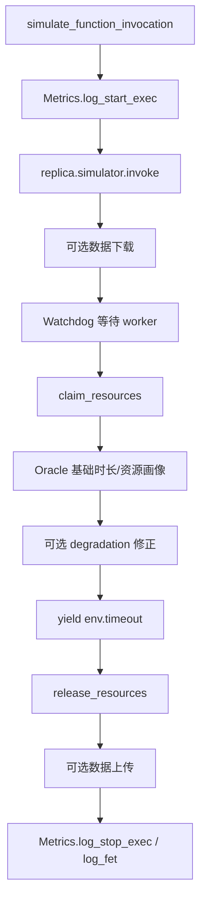

# `sim` 完整业务调用链

## 1. 阅读目标

本章把前面按文件拆开的内容重新串成一次完整实验。源码调试时可从异常所在阶段反向定位对应模块。

## 2. 阶段一：创建实验

实验代码准备：

- Ether `Topology` 及计算节点、网络链路；
- `ImageProperties` 镜像元数据；
- `Function`、`FunctionImage`、`FunctionContainer`；
- `ScalingConfiguration` 和 `FunctionDeployment`；
- RPS/arrival profile；
- `Benchmark`；
- `Simulation`。

这些对象大多是声明，不会自行产生事件。

## 3. 阶段二：装配环境

`Simulation.run()` 调用 `init_environment()`，形成以下依赖图：



随后注册调度 worker、资源监控、空闲检测等后台进程。

## 4. 阶段三：Benchmark 启动部署

```text
benchmark.setup(env)
  -> register_images(env)
  -> benchmark.run(env)
  -> env.faas.deploy(deployment)
```

`DefaultFaasSystem.deploy()`：

1. 把 deployment 加入索引；
2. 把镜像映射到容器规格；
3. 记录部署生命周期；
4. 按 `scale_min` 创建初始副本；
5. 根据配置启动自动伸缩器。

## 5. 阶段四：副本创建和调度



若没有候选节点，流程停在调度失败分支，副本不能进入 `RUNNING`。

## 6. 阶段五：镜像与函数启动

`simulate_function_start()` 依次调用 simulator 生命周期：

```text
state = STARTING
  -> simulator.deploy
       -> docker.pull
       -> registry 查镜像
       -> SafeFlow 拉取缺失镜像
  -> simulator.startup
  -> simulator.setup
       -> HTTP watchdog 可在此创建 worker pool
  -> state = RUNNING
```

各阶段通过 Metrics 记录时间点，可分析调度等待、镜像传输、启动与 setup 成本。

## 7. 阶段六：请求到达

`function_trigger()` 循环读取到达间隔：

```text
yield env.timeout(inter_arrival)
  -> FunctionRequest(function_name)
  -> env.process(env.faas.invoke(request))
```

每个调用是独立 SimPy 进程，因此请求到达不会被上一请求的执行时间串行阻塞。

## 8. 阶段七：发现副本与负载均衡

`DefaultFaasSystem.invoke()`：

1. 根据请求函数名查 deployment；
2. 发现可服务副本；
3. 没有副本时按系统语义等待可用副本；
4. 负载均衡器从 `RUNNING` 副本选择目标；
5. 记录请求等待与执行起点；
6. 进入 `simulate_function_invocation()`。

Round Robin 只决定选择顺序，不负责副本启动或资源申请。

当前源码在等待可用副本后没有刷新 `replicas` 局部列表，因此 scale-from-zero 路径会继续看到旧空列表并抛出异常。这是实现缺陷，不是预期业务语义。

## 9. 阶段八：具体函数执行



通用 `simulate_function_invocation()` 只包装日志与 simulator 调用。下载和上传必须由具体 simulator 在符合业务含义的位置显式执行。

## 10. 阶段九：资源监控与自动伸缩

请求执行期间：

- simulator 向 `ResourceState` 增减当前资源；
- `ResourceMonitor` 周期采样运行副本；
- 快照写入 `MetricsServer`；
- Metrics 同时记录函数级和节点级资源；
- scaler 读取调用计数、队列或 CPU 窗口；
- 目标副本数变化后调用 `scale_up/scale_down`。

扩容副本重新走调度和启动流程，缩容副本走停止、teardown 与清理流程。

当前 `suspend()` 未推进 `scale_down()` 生成器，且 `scale_down()` 会修改正在遍历的待删除列表；scale-to-zero 和多副本缩容实验应在修复这些路径后再用于结论分析。

## 11. 阶段十：输出结果

结构化数据最终保存在 `RuntimeLogger.records`。常见输出方式：

```python
invocations = env.metrics.extract_dataframe('invocations')
utilization = env.metrics.extract_dataframe('node_utilization')
schedules = env.metrics.extract_dataframe('schedule')
```

输出文件和图表应由实验或分析层生成，并满足：

- 文件名对应 measurement 和实验配置；
- 明确仿真时间、秒/毫秒、字节/MB 等单位；
- 原始数据与聚合图分开保存；
- 空 DataFrame 不生成误导性空图；
- 多策略比较使用相同 topology、请求轨迹和随机种子。

## 12. 调试定位表

| 现象 | 优先检查 |
|---|---|
| 副本一直 `CONCEIVED` | scheduler worker、Pod 资源、Skippy predicates |
| 副本一直 `STARTING` | registry 路由、镜像条目、simulator 生命周期 |
| 请求永久等待 | 是否有 `RUNNING` 副本、负载均衡候选 |
| 仿真时间不前进 | 生成器是否注册、是否真的 yield 事件 |
| CPU 一直为零 | simulator 是否写 `ResourceState`、monitor 是否启动 |
| 资源出现负数 | claim/release 是否成对、异常清理 |
| 镜像每次都拉取 | NodeState 是否复用、ImageProperties 是否相等 |
| 自动伸缩不动作 | scaler 是否启动、指标窗口和阈值单位 |
| HPA 报参数错误 | `MetricsServer` 窗口接口与 HPA 调用错配 |
| 图表没有数据 | measurement 名称、logger 后端、DataFrame 是否为空 |
| 退化模型异常 | 资源画像判断、百分位参数、模型特征版本 |

## 13. 新增功能时的边界选择

| 新需求 | 推荐修改位置 |
|---|---|
| 新函数执行时间/资源模型 | `FunctionSimulator` 或其子类 |
| 新 worker 并发语义 | `watchdogs.py` |
| 新请求曲线 | `requestgen.py` |
| 新实验组合 | `Benchmark` 子类 |
| 新调度算法 | Skippy 插件和 `create_scheduler()` |
| 新资源控制器 | `scaling.py` / `hpa.py` |
| 新估计模型 | `oracle/` |
| 新指标字段 | `Metrics`，必要时扩展 logger 后端 |
| 新网络行为 | `topology.py` / `net.py` |

## 14. 最短源码阅读路径

若要从一次请求追到最终记录，按以下函数搜索：

```text
requestgen.function_trigger
-> DefaultFaasSystem.invoke
-> DefaultFaasSystem.next_replica
-> simulate_function_invocation
-> FunctionSimulator.invoke / Watchdog.invoke
-> ResourceState.put_resource/remove_resource
-> Metrics.log_fet/log_invocation
-> RuntimeLogger.log
-> Record
```

若要从一次部署追到副本运行，按以下路径：

```text
BenchmarkBase.run
-> DefaultFaasSystem.deploy
-> scale_up
-> deploy_replica
-> run_scheduler_worker
-> Skippy scheduler.schedule
-> simulate_function_start
-> FunctionState.RUNNING
```

## 15. 最终理解检查

读完整套文档后，应能清楚说明：

1. SimPy 如何推进逻辑时间；
2. `Simulation` 如何装配所有组件；
3. Function、Deployment、Replica、Request 的区别；
4. Skippy 如何选择节点，Ether 如何模拟网络；
5. simulator、watchdog、Oracle 和 degradation 各自负责什么；
6. 资源当前状态如何变成历史窗口和输出指标；
7. 自动伸缩如何读取指标并重新进入部署/删除流程；
8. 输出数据为何能对应回具体函数、副本、节点和请求。
