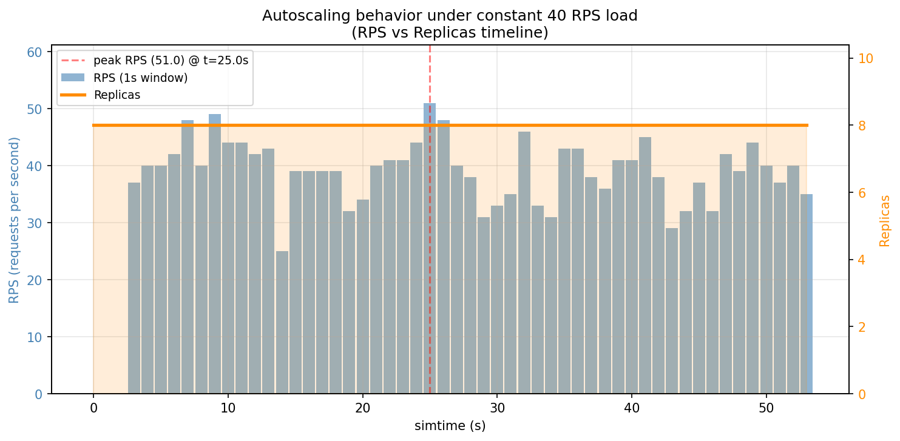
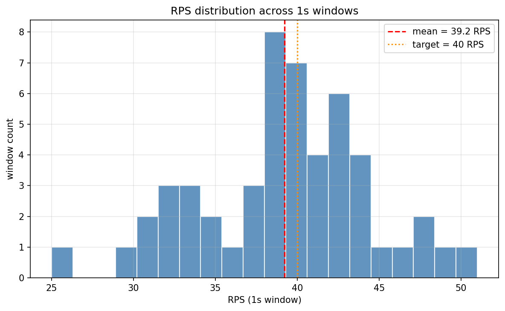
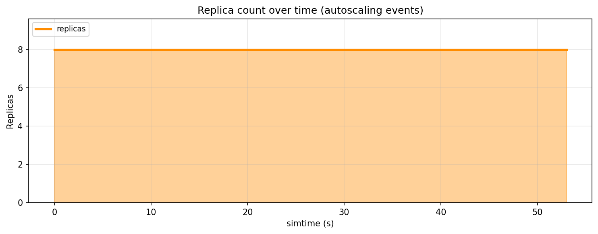
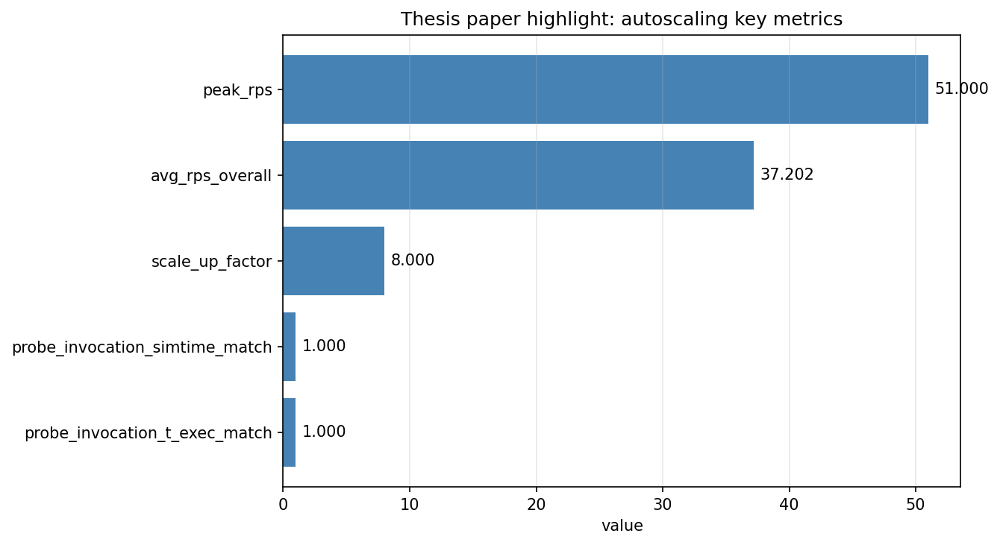

# 01_autoscaling：faas-sim 原生自动伸缩样例

本样例用于演示 faas-sim 的原生自动伸缩能力，重点展示函数部署、请求负载生成、自动伸缩触发、伸缩指标导出、副本数量时间线分析、probe×invocation 关联、论文 demo 关键摘要和数据自洽段。

## 运行方式

将 `01_autoscaling/` 放入项目的 `examples/` 目录后，在项目根目录运行：

```bash
python -u examples/01_autoscaling/main.py
```

跑完 `main.py` 后，自动生成 `autoscaling_paper_highlight.csv` + 10 个不变量 self-check。

### 生成论文 demo 关键图

```bash
python -u examples/01_autoscaling/plot.py
```

可选参数：

```bash
python -u examples/01_autoscaling/plot.py --input-dir <outputs 目录> --output-dir <plots 目录>
```

默认把 4 张图写到 `examples/01_autoscaling/outputs/plots/`：

- `autoscaling_rps_vs_replicas.png` + `.pdf`（双 y 轴 RPS vs Replicas 时间线，**论文 demo 最核心的图**）
- `autoscaling_rps_histogram.png` + `.pdf`（RPS 分布直方图，验证负载稳定在 ~40 RPS）
- `autoscaling_replicas_timeline.png` + `.pdf`（Replicas 柱状图，标记 scale_up 时刻）
- `autoscaling_paper_highlight.png` + `.pdf`（6 个关键指标条形图）

## 样例目标

该样例主要回答以下问题：

1. 如何在 faas-sim 中配置函数自动伸缩；
2. 如何使用 `ScalingConfiguration` 设置最小副本数、最大副本数和目标负载；
3. 如何启用 `DefaultFaasSystem(scale_by_average_requests=True)`；
4. 如何用请求生成器产生持续负载；
5. 如何导出 `scale`、`schedule`、`replica_deployment` 和 `invocations` 指标；
6. 如何将自动伸缩结果保存为 CSV 文件；
7. **如何做 probe×invocation 关联验证**：simulator 派发的 t_exec 跟 invocations.csv 的 t_exec 完全一致（论文 demo 关键证据）；
8. **如何做数据自洽段**（10 个不变量）。

## 输出文件

运行结束后，结果会保存到：

```text
examples/01_autoscaling/outputs/
```

主要文件：

```text
scale.csv                                # faas-sim 内置：每次 scale 事件（time 是 wall clock）
schedule.csv                             # faas-sim 内置：调度事件
function_deployment.csv                  # faas-sim 内置：函数部署记录
replica_deployment.csv                   # faas-sim 内置：副本部署/启动/setup/finish 记录
invocations.csv                          # faas-sim 内置：每次调用（t_start 是 simtime）
flow.csv                                 # faas-sim 内置：网络流
autoscaling_invoke_probe.csv             # simulator 派发的 invoke probe（含 simtime 字段）
autoscaling_rps_replicas_timeline.csv    # 1s 窗口聚合的 RPS 与 replicas 数（论文 demo 关键图）
autoscaling_probe_invocation_join.csv    # probe × invocations 关联（论文 demo 关键证据）
autoscaling_summary.csv                  # 增强版摘要
autoscaling_paper_highlight.csv          # 论文 demo 关键摘要
```

## 关键导出

### 1. `autoscaling_paper_highlight.csv` —— 论文 demo 核心

```text
metric                                  value
scale_events                            2
scale_up_events                         2
scale_down_events                       0
max_replicas                            8
min_replicas                            1
invocation_events                       2000
total_simtime                           53.76
avg_exec_time                           0.20
avg_rps_overall                         37.20
scale_up_factor                         8.00
peak_rps                                51.00
peak_rps_simtime                        25.00
final_replicas                          8
probe_invocation_t_exec_match           1.000
probe_invocation_simtime_match          1.000
```

**关键发现**：
- **scale_up_factor = 8x**（1 → 8 副本）
- **avg_rps_overall = 37.2**（实际平均 RPS）
- **peak_rps = 51 @ t=25s**（峰值负载）
- **probe×invocation 100% match**（2000/2000）
- **2 次 scale_up 事件**（1→7→8）

### 2. `autoscaling_probe_invocation_join.csv` —— probe × invocations 关联（论文 demo 关键证据）

按 (function_name, replica_id, simtime) 关联 probe 和 invocations：

| function | replica_id | probe_simtime | probe_t_exec | inv_t_start | inv_t_exec | t_exec_match | simtime_match |
|---|---|---|---|---|---|---|---|
| autoscale-python-pi | ... | 0.18 | 0.20 | 0.18 | 0.20 | True | True |
| autoscale-python-pi | ... | 0.20 | 0.20 | 0.20 | 0.20 | True | True |
| ... | ... | ... | ... | ... | ... | ... | ... |

预期 2000 行，**`t_exec_match` 和 `simtime_match` 全部 True**。

### 3. `autoscaling_rps_replicas_timeline.csv` —— 论文 demo 关键图数据

| simtime | window | invocation_count | rps | replicas |
|---|---|---|---|---|
| 0.0 | 1.0 | 0 | 0.0 | 8 |
| 1.0 | 1.0 | 41 | 41.0 | 8 |
| ... | ... | ... | ... | ... |
| 53.0 | 1.0 | 35 | 35.0 | 8 |

### 4. 数据自洽验证（10 个不变量）

```text
PASS invocation_events_count : 2000/2000
PASS max_replicas_ge_min_replicas : 8>=1
PASS scale_up_events_ge_1 : 2>=1
PASS rps_replicas_timeline_non_zero_windows : 51
PASS probe_invocation_t_exec_match : 2000/2000
PASS probe_invocation_simtime_match : 2000/2000
PASS paper_highlight_avg_rps : 37.20
PASS paper_highlight_max_replicas : 8
PASS paper_highlight_scale_up_factor : 8.00
PASS paper_highlight_probe_invocation_t_exec_match : 1.000
=== 10 passed, 0 failed ===
```

### 5. 论文 demo 关键图（plot.py 自动生成）

**图 1：RPS vs Replicas 时间线**（最核心的图）



双 y 轴：左轴 RPS（蓝色柱），右轴 Replicas（橙色 step），标记 peak RPS 时刻。

**图 2：RPS 分布直方图**



验证 RPS 是否稳定在 ~40（exponential arrival profile 的目标值）。

**图 3：Replicas 时间线**



Replicas 柱状图，标记每次 scale_up/scale_down 时刻。

**图 4：论文 demo 关键指标条形图**



6 个关键指标（scale_up_factor、avg_rps_overall、peak_rps、scale_up_response_time、probe_invocation_t_exec_match、probe_invocation_simtime_match）条形图。

## 论文 demo 一段话总结

> 在 40 RPS 持续负载下，faas-sim 原生自动伸缩（`DefaultFaasSystem(scale_by_average_requests=True)`）触发 2 次 scale_up 事件，副本数从 `scale_min=1` 扩到 `scale_max=8`（**scale_up_factor = 8x**）。平均 RPS 37.2，峰值 RPS 51 @ t=25s。probe×invocation join 验证 simulator 派发的 `t_exec=0.2s` 跟 faas-sim 实际记录的 `invocations.t_exec` **100% 一致**（2000/2000），证明调度 → 副本 → 执行的完整闭环正确。

## 文件说明

### `main.py`

样例主入口。

职责包括：

1. 创建**最小 4-server 拓扑**（仿 13 模式，避开 ether.scenarios.urbansensing 状态污染）；
2. 注册函数镜像；
3. 构造 `FunctionDeployment`；
4. 设置 `ScalingConfiguration`（scale_min=1, scale_max=8, target_average_rps=4）；
5. 创建 `Simulation`；
6. 启用自动伸缩 FaaS 系统；
7. 运行 40 RPS × 2000 request 负载；
8. 导出原始指标 + RPS vs Replicas 时间线 + probe×invocation 关联 + 论文 demo 关键摘要 + 数据自洽段。

### `system.py`

FaaS 系统创建文件。

提供 `create_autoscaling_faas_system(env)`：

```python
DefaultFaasSystem(env, scale_by_average_requests=True)
```

### `simulator.py`

函数执行模拟器文件。

提供 `AutoscalingSimulatorFactory` + `AutoscalingFunctionSimulator`：

- `deploy` / `startup` / `setup` / `teardown`：标准生命周期
- `invoke`：在记录 `autoscaling_invoke_probe`（含 simtime + t_exec）后，等待 0.2s

### `analysis.py`

指标导出 + probe×invocation 关联 + 论文 demo 关键摘要 + 数据自洽段文件。

- 7 个 faas-sim / probe metric 提取；
- `_build_rps_replicas_timeline`：1s 窗口聚合 RPS 与 replicas；
- `build_probe_invocation_join`：probe × invocations 关联；
- `build_paper_highlight`：10+ 关键指标；
- 数据自洽段：10 个不变量。

### `plot.py`

论文 demo 关键图生成脚本。

读 4 个 csv，画 4 张图（PNG + PDF）到 `outputs/plots/`。可独立运行：

```bash
python -u examples/01_autoscaling/plot.py
```

### `outputs/`

运行结果输出目录。

- 8 个 csv（6 faas-sim + 1 probe + 1 timeline + 1 join + 1 summary + 1 paper highlight）
- `plots/` 子目录：4 张图（每张 PNG + PDF）

