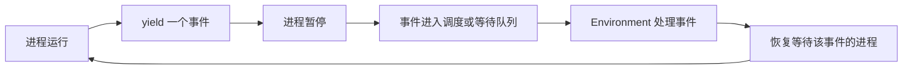

# 01. SimPy 概念与组成

SimPy 是一个基于 Python 的离散事件仿真框架。它把系统中的活动建模成“进程”，把等待、完成、失败、资源请求等状态变化建模成“事件”，再由仿真环境按时间顺序推进这些事件。

在 SimPy 中，时间不是现实中的墙钟时间，而是仿真时间。仿真时间可以代表秒、分钟、小时、天，也可以代表任意抽象时间单位。只要模型内部保持一致，SimPy 并不关心这个单位是什么。

## 什么是离散事件仿真

离散事件仿真关注系统在一系列离散时间点上的状态变化。例如：

- 顾客到达银行。
- 顾客开始排队。
- 柜员服务某个顾客。
- 服务结束。
- 顾客离开。

系统状态只在这些事件发生时改变。两个事件之间，即使仿真时间从 10 走到 100，只要没有事件，系统就不需要逐时刻计算。

这类方法适合建模：

- 排队系统：银行、医院、客服中心、服务器请求队列。
- 资源竞争：机器、CPU、GPU、车辆、泊位、人员。
- 生产系统：工厂、流水线、仓储、物流。
- 计算系统：函数计算、容器调度、批处理任务。
- 供应和库存：油箱、缓存、队列、物料池。

不适合的场景：

- 必须连续求解微分方程的物理系统。
- 重点是连续空间运动和几何碰撞的仿真。
- 需要真实渲染和复杂三维交互的场景。

## SimPy 的核心思想

SimPy 用 Python 生成器描述进程。一个进程运行到 `yield` 时暂停，把控制权交回仿真环境；当 `yield` 出去的事件被触发后，仿真环境再恢复这个进程。

最小模型如下：

```python
import simpy


def clock(env):
    while True:
        print("当前仿真时间:", env.now)
        yield env.timeout(1)


env = simpy.Environment()
env.process(clock(env))
env.run(until=5)
```

这里的执行含义是：

1. `Environment()` 创建仿真环境。
2. `env.process(clock(env))` 把生成器注册成 SimPy 进程。
3. `yield env.timeout(1)` 表示当前进程暂停 1 个仿真时间单位。
4. `env.run(until=5)` 推进仿真，直到仿真时间到达 5。

## 五个核心概念

### 1. Environment：仿真环境

`Environment` 是仿真的调度器，也是仿真时间的来源。

它负责：

- 维护当前仿真时间 `env.now`。
- 保存未来事件队列。
- 按时间顺序弹出事件并触发。
- 恢复等待事件的进程。
- 提供创建事件、进程和超时的快捷方法。

常用接口：

```python
env = simpy.Environment()
env.now              # 当前仿真时间
env.timeout(3)       # 创建一个 3 个时间单位后触发的事件
env.event()          # 创建一个普通事件
env.process(proc())  # 注册一个进程
env.run(until=10)    # 运行到指定时间或事件
env.peek()           # 查看下一个事件时间
env.step()           # 执行下一个事件
```

### 2. Event：事件

事件表示“未来某个条件会完成”。进程通过 `yield event` 等待事件。

事件可以表示：

- 时间过去：`env.timeout(5)`。
- 某个进程结束：`env.process(worker(env))`。
- 资源请求成功：`resource.request()`。
- 库存可用：`container.get(amount)`。
- 对象到达队列：`store.get()`。
- 自定义信号完成：`env.event().succeed(value)`。

事件有三个重要状态：

| 状态 | 含义 |
| --- | --- |
| 未触发 | 事件还没有结果，等待者继续暂停 |
| 已触发 | 事件已经有结果，但可能还没被环境处理 |
| 已处理 | 环境已经恢复所有等待该事件的进程 |

事件结果可以是成功值，也可以是失败异常。

### 3. Process：进程

进程是用生成器函数写出来的活动逻辑。进程本身也是一种事件：当进程函数执行结束时，这个进程事件成功；如果进程抛出异常，这个进程事件失败。

```python
def job(env):
    yield env.timeout(2)
    return "done"


proc = env.process(job(env))
result = yield proc
```

进程适合表示：

- 一个顾客的一生。
- 一台机器的工作循环。
- 一个请求从进入系统到完成的流程。
- 一个调度器不断检查队列并分配任务。

### 4. Resource：资源

资源表示有限数量的可占用对象，例如柜台、机器、CPU 核、GPU、车辆、工作人员。

```python
machine = simpy.Resource(env, capacity=1)

with machine.request() as req:
    yield req
    yield env.timeout(5)
```

当资源不可用时，请求事件会排队；资源释放后，排队请求按规则被触发。

### 5. Store 与 Container：库存和对象流

`Container` 表示连续数量，例如油量、电量、缓存容量。

```python
tank = simpy.Container(env, capacity=100, init=40)
yield tank.get(10)
yield tank.put(20)
```

`Store` 表示离散对象队列，例如消息、任务、包裹、订单。

```python
queue = simpy.Store(env)
yield queue.put({"id": 1})
item = yield queue.get()
```

## SimPy 的组成模块

从官方 API 和源码结构看，SimPy 主要由以下部分组成：

| 模块 | 作用 |
| --- | --- |
| `simpy.core` | 仿真环境、事件队列、调度循环 |
| `simpy.events` | 基础事件、超时、进程、条件事件、中断 |
| `simpy.resources.resource` | 普通资源、优先级资源、抢占资源 |
| `simpy.resources.container` | 连续容量资源 |
| `simpy.resources.store` | 对象存储和过滤存储 |
| `simpy.rt` | 实时仿真环境 |
| `simpy.util` | 延迟启动、事件订阅等工具函数 |

理解 SimPy 时可以把它拆成两层：

- 调度层：`Environment` 和 `Event` 负责事件何时发生、谁被恢复。
- 建模层：`Process`、`Resource`、`Container`、`Store` 帮你表达业务对象。

## SimPy 的执行模型

一次典型执行流程如下：

1. 用户创建环境。
2. 用户注册一个或多个进程。
3. 进程启动后运行到第一个 `yield`。
4. `yield` 出来的事件被放入事件队列，或挂到资源等待队列。
5. 环境从事件队列取出最早的事件。
6. 事件被处理，等待该事件的进程恢复执行。
7. 进程继续运行，直到再次 `yield`、正常结束或抛出异常。
8. 重复以上步骤，直到没有事件或到达停止条件。

可以用这张简图理解：



## 为什么生成器适合仿真

生成器让代码能按自然顺序书写：

```python
def customer(env, counter):
    arrive = env.now
    with counter.request() as req:
        yield req
        wait = env.now - arrive
        yield env.timeout(3)
```

这段代码看起来像同步流程：

1. 顾客到达。
2. 请求柜台。
3. 等到柜台可用。
4. 统计等待时间。
5. 接受服务。

但实际执行中，每个 `yield` 都会把控制权交回仿真环境，所以多个顾客进程可以交错运行。

## 建模时如何拆分对象

建模 SimPy 系统时，通常按以下问题拆分：

| 问题 | 对应 SimPy 元素 |
| --- | --- |
| 谁会主动行动？ | 进程 |
| 谁需要等待？ | 事件 |
| 谁数量有限？ | `Resource` |
| 什么是连续库存？ | `Container` |
| 什么是离散对象队列？ | `Store` |
| 谁需要抢占？ | `PreemptiveResource` |
| 谁需要按条件取对象？ | `FilterStore` |
| 需要统计什么？ | 日志、监控器、回调 |

例如函数计算平台可以这样映射：

| 业务概念 | SimPy 表达 |
| --- | --- |
| 请求 | 一个进程或一个 `Store` 中的任务对象 |
| 函数实例 | `Resource`、进程或自定义对象 |
| CPU / 内存 / GPU | `Resource` 或 `Container` |
| 队列 | `Store` |
| 冷启动 | `yield env.timeout(cold_start_time)` |
| 执行时间 | `yield env.timeout(service_time)` |
| 调度器 | 一个长期运行的进程 |
| 超时取消 | `AnyOf` 或中断 |

## 常见误解

### 误解 1：`yield env.timeout(5)` 会等待真实 5 秒

默认不会。它等待的是 5 个仿真时间单位，通常瞬间完成。只有 `RealtimeEnvironment` 才会把仿真时间和真实时间绑定。

### 误解 2：资源请求就是立即得到资源

不是。`resource.request()` 返回的是一个事件。必须 `yield req`，进程才会等待到请求成功。

### 误解 3：进程是线程

不是。SimPy 进程是生成器，由仿真环境协作调度，不是操作系统线程。它不会并行执行 Python 字节码。

### 误解 4：仿真会自动产生统计指标

不会。SimPy 提供机制，不强制统计模型。等待时间、利用率、吞吐量、队列长度等指标需要用户自己记录，或给资源操作加监控包装。

## 小结

SimPy 的核心可以概括为一句话：

> 用生成器写进程，用事件表达等待，用环境推进时间，用资源表达竞争。

如果能分清“谁是进程、谁是事件、谁是资源、谁是库存、谁是队列”，大多数 SimPy 模型就能自然搭出来。
